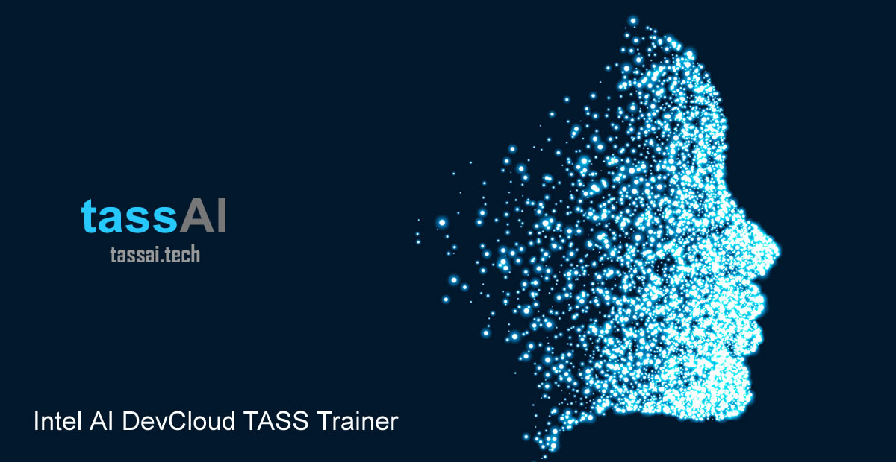
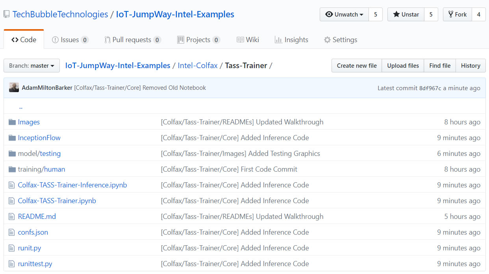

# IoT JumpWay Intel® AI DevCloud / TASS Colfax Trainer



## Introduction

There have been many versions of the TASS computer vision projects over the years, one being a version built on a Raspberry Pi 3 using a program based on the Tensorflow Inception V3 transfer learning example.

The TASS Colfax Trainer replicates the transfer learning side of the original program and is trained on the Intel AI DevCloud HPC Cluster (Colfax Cluster).

## Python Versions

- Python 3 (Intel, 2018 update 1)

## Software requirements

- Intel Optimized TensorFlow (1.3.1)

## Hardware requirements

- Access to the Intel AI DevCloud HPC Cluster (Colfax Cluster)

## Cloning The Repo

You will need to clone this repository to a location on your development terminal. Navigate to the directory you would like to download it to and issue the following commands.

    $ git clone https://github.com/iotJumpway/IoT-JumpWay-Intel-Examples.git

Once you have the repo, you will need to find the files in this folder located in [this location](https://github.com/iotJumpway/IoT-JumpWay-Intel-Examples/tree/master/Intel-Colfax/Tass-Trainer "this location")

## Install Requirements

Everything for this tutorial is already provided on Colfax.

## Login To Colfax

Login to your Colfax Notebook area by following [this link](https://access.colfaxresearch.com/?p=connect "this link").

## Upload Structure To Colfax

Once you have completed the steps above, it is time to login to Colfax and upload the structure described above. You need to upload all of the files shown in the screen shot below, with exception to the README.



## Training & Testing Data


You can train and test this example without finding any additional training and testing data, but if you would like to add your own classes you will find the training data in the training/human directory.

The test data provided (Collected from Google) has two classes, 1 and 2, these folders represent Darth Vader and Yoda, in these directories (classes) are 30 images of each character, directory 1 represents Darth and directory 2 represents Yoda.

You can name these directories what you like, the name of the directory will be used in the predictions, so if the program detects Darth in an image it will return 1 as the highest prediction.

You can add as many as classes as you like, each class will slow the training down. Each class should have no less than 30 images, generally any more than 25 but less than 30 will crash the script with devision by 0 right at the end of the training process.

## Start The Training

Now it is time to start the training, head on over to [TASS Colfax Trainer notebook](https://github.com/iotJumpway/IoT-JumpWay-Intel-Examples/blob/master/Intel-Colfax/Tass-Trainer/Colfax-TASS-Trainer.ipynb "TASS Colfax Trainer notebook") on Colfax. You do not need to execute any of the code blocks except for the first until you get to "Create training job", here you can begin to execute the blocks of code following the guide which will submit a job to train TASS on the Colfax Clusters.

## Testing The Trained Model

Now time for the crunch, again, you do not need to find any  additional training to test this program, but if you do want to you can add more images to the model/testing directory. The testing data provided for out of the box use of this tutorial include 2 images of Darth, 2 of Yoda, and 2 of a very handsome guy ;)

Head on over to [TASS Colfax Trainer Inference notebook](https://github.com/iotJumpway/IoT-JumpWay-Intel-Examples/blob/master/Intel-Colfax/Tass-Trainer/Colfax-TASS-Trainer-Inference.ipynb "TASS Colfax Trainer Inference notebook") on Colfax. You do not need to execute any of the code blocks except for the first until you get to "Create testing job", here you can begin to execute the blocks of code following the guide which will submit a job to test TASS on the Colfax Clusters.

The output for me was as follows:

```

TESTING FACIAL REC

FILE: Darth1.jpg
1 (score = 0.99834)
2 (score = 0.00164)


PROVIDED IMAGE: Darth1.jpg
OBJECT DETECTED: 1
CONFIDENCE: 0.998343
...

FILE: Darth2.jpg
1 (score = 0.99692)
2 (score = 0.00311)


PROVIDED IMAGE: Darth2.jpg
OBJECT DETECTED: 1
CONFIDENCE: 0.996923
...

FILE: Yoda2.jpg
2 (score = 0.99710)
1 (score = 0.00293)


PROVIDED IMAGE: Yoda2.jpg
OBJECT DETECTED: 2
CONFIDENCE: 0.997104
...

FILE: Yoda1.jpg
2 (score = 0.99535)
1 (score = 0.00465)

FILE: VeryHansomeGuy.jpg
2 (score = 0.72019)
1 (score = 0.27821)

FILE: VeryHansomeGuy2.jpg
2 (score = 0.59470)
1 (score = 0.40845)

COMPLETED TESTING FACIAL RECOGNITION
```

This means that Darth was identified in each image, Yoda in 1 and the program successfully identified me as an unknown person.

## Bugs/Issues

Please feel free to create issues for bugs and general issues you come across whilst using this or any other Intel® related IoT JumpWay issues. You may also use the issues area to ask for general help whilst using the IoT JumpWay in your IoT projects.

## Contributors

[](https://github.com/iotJumpway)


