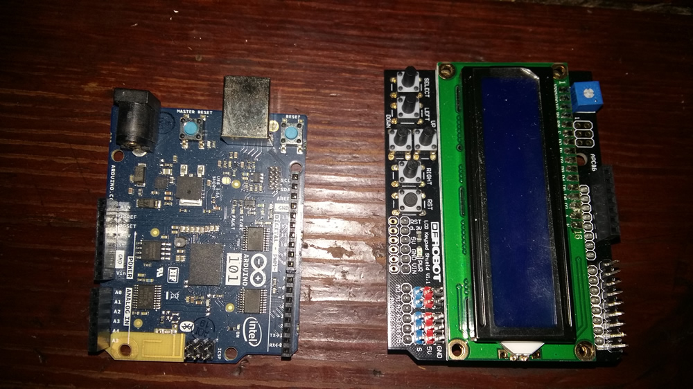
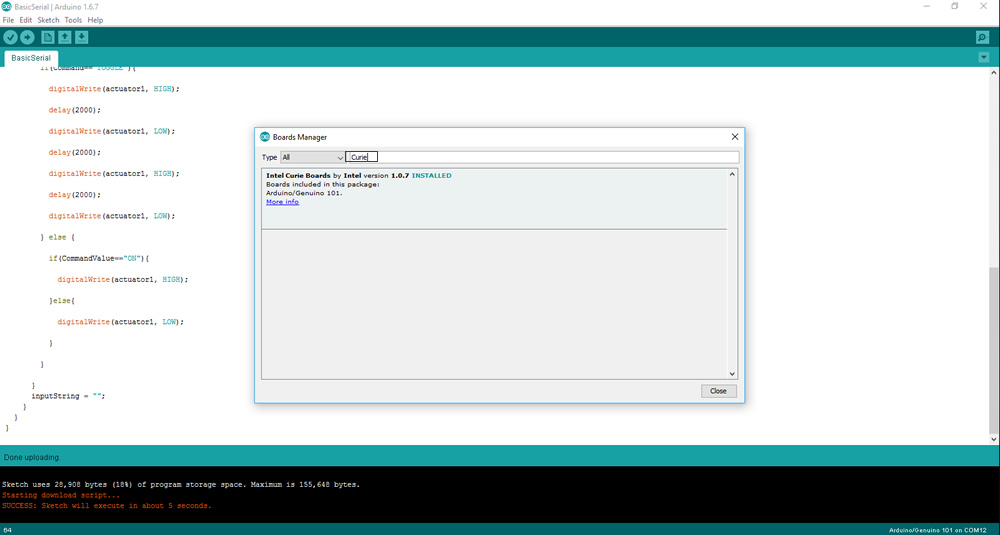
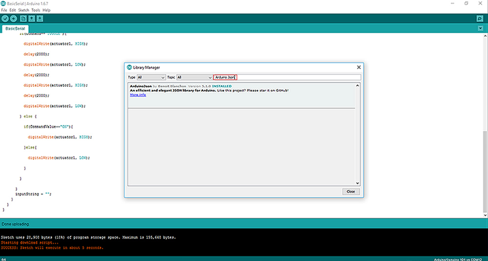
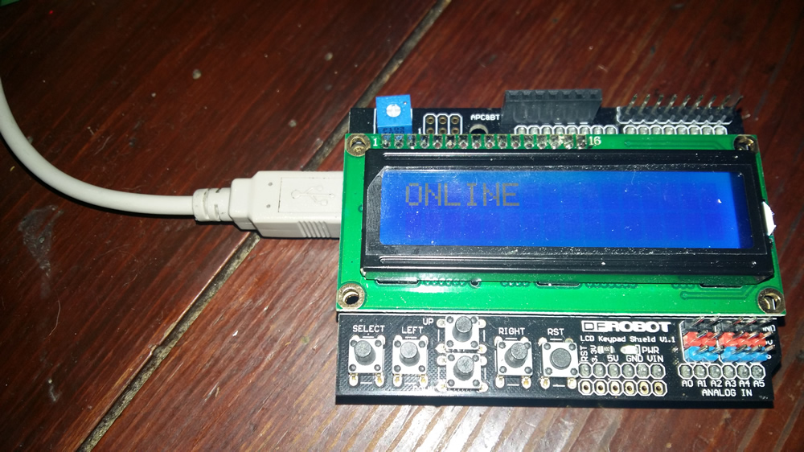

# IoT JumpWay Intel® Arduino/Genuino 101 DFRobot LCD Control Example

  

## Introduction

Here you will find sample device scripts for connecting Intel® Arduino/Genuino 101 and DFRobot LCD Keypad Shield to the TechBubble Technologies IoT JumpWay using the Python MQTT Serial Library. The codes allow you to set up a basic device that allows control of your IoT devices using the LCD Keypad Shield and communication via the IoT JumpWay. In addition to using the LCD Keypad Shield, you can also use a an application or autonomous device communication via the IoT JumpWay to switch the states of the buttons on the keypad. 

Once you understand how it works you are free to add as many actuators and sensors to your device and modify your code accordingly.

##This project uses three applications:

1. A device application (Arduino) which communicates via serial with a Python Serial/MQTT application.
2. The Python Serial/MQTT application which communicates with the Arduino/Genuio 101 / DFRobot LCD Keypad Shield, and the IoT JumpWay.
3. A Python commands application / device application that can send commands to the device to toggle the state of the buttons. In this tutorial we will use the [Intel® Edison Dev Kit LED Python Example](https://github.com/TechBubbleTechnologies/IoT-JumpWay-Intel-Examples/tree/master/Intel-Edison/Dev-Kit-LED/Python "Intel® Edison Dev Kit LED Python Example") which has both a device application and commands application. (Optional)

## Python Versions

- 2.7 (Python Serial/MQTT application)
- 3.4 or above (Python commands application)

## Software requirements

1. [TechBubble IoT JumpWay Python MQTT Serial Library](https://github.com/TechBubbleTechnologies/IoT-JumpWay-Python-MQTT-Serial-Client "TechBubble IoT JumpWay Python MQTT Serial Library")
2. Arduino/Genuino IDE
3. ArduinoJson

## Hardware Requirements



1. Intel® Arduino/Genuino 101.
2. DFRobot LCD Keypad Shield
5. An IoT device connected to the TechBubble IoT JumpWay (Optional)

## Before You Begin

If this is the first time you have used the TechBubble IoT JumpWay in your IoT projects, you will require a developer account and some basics to be set up before you can start creating your IoT devices. Visit the following link and check out the guides that take you through registration and setting up your Location Space, Zones, Devices and Applications.

[TechBubble Technologies IoT JumpWay Developer Program (BETA) Docs](https://github.com/TechBubbleTechnologies/IoT-JumpWay-Docs/ "TechBubble Technologies IoT JumpWay Developer Program (BETA) Docs")

## Adding The Arduino/Genuino Board To Arduino IDE

        - Tools -> Boards -> Boards Manager
        - Search for Curie, or Intel Curie
        - Right click on the right hand side of the Curie section and install the latest version



## Install Requirements On Your PC & Arduino/Genuino 101

1. For the Python Serial/MQTT application we will need the [TechBubble IoT JumpWay Python MQTT Serial Library](https://github.com/TechBubbleTechnologies/IoT-JumpWay-Python-MQTT-Serial-Client "TechBubble IoT JumpWay Python MQTT Serial Library") installed on our PC/laptop/Mac. To Install the library, issue the following command on your chosen device:

    ```
        $ pip install iot_jumpway_mqtt_serial
    ```

2. Install the ArduinoJson library in the Arduino IDE:

    ```
        Sketch -> Include Library -> Manage Libraries
        Search for ArduinoJson
        Right click on the right hand side of the ArduinoJson section and install the latest version
    ```



## Setting Up Your Intel® Arduino/Genuino 101



First of all you need to connect up your DFRobot LCD Keypad Shield to your Intel® Arduino/Genuino 101, place the shield on top of your Arduino as in the image above. 

## Device Connection Credentials & Actuator Settings

- Follow the [TechBubble Technologies IoT JumpWay Developer Program (BETA) Location Device Doc](https://github.com/TechBubbleTechnologies/IoT-JumpWay-Docs/blob/master/4-Location-Devices.md "TechBubble Technologies IoT JumpWay Developer Program (BETA) Location Device Doc") to set up your main device, if you want to use a second device to trigger autonomous communication, please follow the [Intel® Edison Dev Kit LED Python Example](https://github.com/TechBubbleTechnologies/IoT-JumpWay-Intel-Examples/tree/master/Intel-Edison/Dev-Kit-LED/Python "Intel® Edison Dev Kit LED Python Example") tutorial, we will show you how to set up the autonomous communication later in this tutorial. You will need to select the "LCD Keypad (4 Buttons)" actuator whilst setting up your device in the developer console.

  

- Download the [TechBubble IoT JumpWay Python MQTT Serial Library Application](https://github.com/TechBubbleTechnologies/IoT-JumpWay-Python-MQTT-Serial-Client/blob/master/application.py "TechBubble IoT JumpWay Python MQTT Serial Library Application") and the [TechBubble IoT JumpWay Python MQTT Serial Library Config File](https://github.com/TechBubbleTechnologies/IoT-JumpWay-Python-MQTT-Serial-Client/blob/master/config.json "TechBubble IoT JumpWay Python MQTT Serial Library Config File"). Retrieve your connection credentials by following the link above, and update the config.json file with your new connection  credentials.

```
	"IoTJumpWaySettings": {
        "SystemLocation": 0,
        "SystemZone": 0,
        "SystemDeviceID": 0,
        "SystemDeviceName" : "Your Device Name",
        "SystemDeviceCom" : "Your Device Com Port"
    },
	"IoTJumpWayMQTTSettings": {
        "MQTTUsername": "Your Device MQTT Username",
        "MQTTPassword": "Your Device MQTT PASSWORD"
    }
```

- Open up the [Intel® Arduino/Genuino 101 DFRobot LCD Control Example](https://github.com/TechBubbleTechnologies/IoT-JumpWay-Intel-Examples/blob/master/Intel-Arduino-101/3RD-PARTY-DFRobot/LCD-Control/LCD-Control.ino "Intel® Arduino/Genuino 101 DFRobot LCD Control Example") and update the following lines with your DFRobot LCD Keypad Shield ID retrieved from the steps above, then upload the sketch to your device:

    ```
        String JumpWaySensorID = "0";
    ```

- You may also need to alter the debounceWait variable if the buttons trigger multiple times.

    ```
        int debounceWait = 150;
    ```

## Execute The Python Program

As you have already uploaded your sketch, the program will now be running on your Arduino/Genuino 101. All that is left is to start the Python program with the following line:

    $ python NameOfYourSerialApplication.py 

## Autonomous Communication With Second Device

COMING SOON

## Viewing Your Data  

Each time you press a button, it will send data to the [TechBubble IoT JumpWay](https://iot.techbubbletechnologies.com/ "TechBubble IoT JumpWay"). You will be able to access the data in the [TechBubble IoT JumpWay Developers Area](https://iot.techbubbletechnologies.com/developers/dashboard/ "TechBubble IoT JumpWay Developers Area"). Once you have logged into the Developers Area, visit the [TechBubble IoT JumpWay Location Devices Page](https://iot.techbubbletechnologies.com/developers/location-devices "Location Devices page"), find your device and then visit the Sensor/Actuator page and the Warnings page to view the data sent from your device.


## IoT JumpWay Intel® Arduino/Genuino 101 Examples Bugs/Issues

Please feel free to create issues for bugs and general issues you come across whilst using the IoT JumpWay Intel® Arduino/Genuino 101 Examples. You may also use the issues area to ask for general help whilst using the IoT JumpWay Intel® Arduino/Genuino 101 Examples in your IoT projects.

## IoT JumpWay Intel® Arduino/Genuino 101 Examples Contributors

- [Adam Milton-Barker, TechBubble Technologies Founder](https://github.com/AdamMiltonBarker "Adam Milton-Barker, TechBubble Technologies Founder")

  