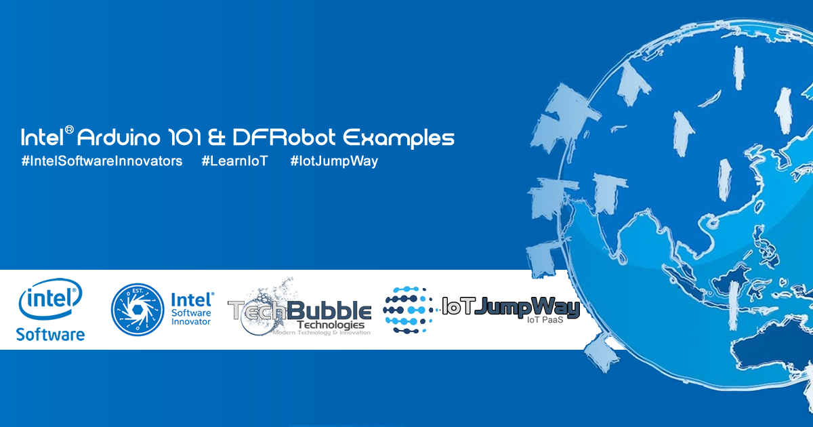

# IoT JumpWay Intel® Arduino 101 & DFRobot Examples

  

## Introduction

The Intel® Arduino 101 & DFRobot examples provide example projects that you can use to get started with using the TechBubble IoT JumpWay for your Intel® Arduino 101 & DFRobot projects.

## Intel® Arduino 101 & DFRobot Examples

- [Intel® Arduino 101 DF Robot LCD Control Example](https://github.com/TechBubbleTechnologies/IoT-JumpWay-Intel-Examples/tree/master/Intel-Arduino-101/3RD-PARTY-DFRobot/LCD-Control "Intel® Arduino 101 DF Robot LCD Control Example")

- [Intel® Arduino 101 DF Robot LCD Intruder System Example](https://github.com/TechBubbleTechnologies/IoT-JumpWay-Intel-Examples/tree/master/Intel-Arduino-101/3RD-PARTY-DFRobot/LCD-Intruder-System "Intel® Arduino 101 DF Robot LCD Intruder System Example")

## IoT JumpWay Intel® Arduino 101 & DFRobot Bugs/Issues

Please feel free to create issues for bugs and general issues you come across whilst using the IoT JumpWay Intel Examples. You may also use the issues area to ask for general help whilst using the IoT JumpWay Intel Examples in your IoT projects.

## IoT JumpWay Intel® Arduino 101 & DFRobot Contributors

- [Adam Milton-Barker, TechBubble Technologies Founder](https://github.com/AdamMiltonBarker "Adam Milton-Barker, TechBubble Technologies Founder")

  