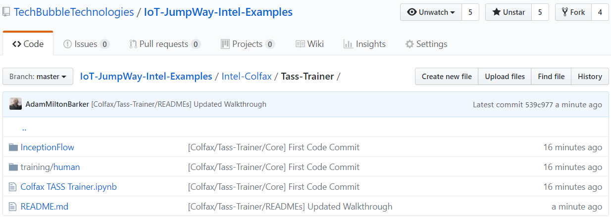

# IoT JumpWay Intel® Nervana AI / Colfax TASS Trainer

## Introduction

There have been many versions of the TASS computer vision projects over the years, one being a version built on a Raspberry Pi 3 using a program based on the Tensorflow Inception V3 transfer learning example. 

The Colfax TASS Trainer replicates the transfer learning side of the original program and is trained on the Intel Nervana AI HPC Cluster (Colfax Cluster).

## Python Versions

- Python 3 (Intel, 2018 update 1)

## Software requirements

- Intel Optimized TensorFlow (1.3.1)

## Hardware requirements

- Access to the Intel Nervana AI HPC Cluster (Colfax Cluster)

## Cloning The Repo

You will need to clone this repository to a location on your development terminal. Navigate to the directory you would like to download it to and issue the following commands.

    $ git clone https://github.com/TechBubbleTechnologies/IoT-JumpWay-Intel-Examples.git
	
Once you have the repo, you will need to find the files in this folder located in [this location](https://github.com/TechBubbleTechnologies/IoT-JumpWay-Intel-Examples/tree/master/Intel-Colfax/Tass-Trainer "this location")

## Install Requirements

Everything for this tutorial is already provided on Colfax.

## Upload Structure To Colfax

Once you have completed the steps above, it is time to login to Colfax and upload the structure described above. You need to upload all of the files shown in the screen shot below, with exception to the README.

## Start The Training

The next step is to start the training, for this login to your Colfax Notebook area by following [this link](https://access.colfaxresearch.com/?p=connect "this link"), and then open up the Colfax-TASS-Trainer.ipynb. At this point you do not need to execute any of the blocks, follow the tutorial until you get to "Create training job", here you can begin to execute the blocks of code following the guide which will submit a job to train TASS on the Colfax Clusters.

## Intel® Nervana AI / Colfax TASS Trainer Bugs/Issues

Please feel free to create issues for bugs and general issues you come across whilst using the Intel® Nervana AI / Colfax TASS Trainer example. You may also use the issues area to ask for general help whilst using the IoT JumpWay Intel® Examples in your IoT projects.

## Intel® Nervana AI / Colfax TASS Trainer Contributors

- [Adam Milton-Barker, TechBubble Technologies Founder](https://github.com/AdamMiltonBarker "Adam Milton-Barker, TechBubble Technologies Founder")

 

