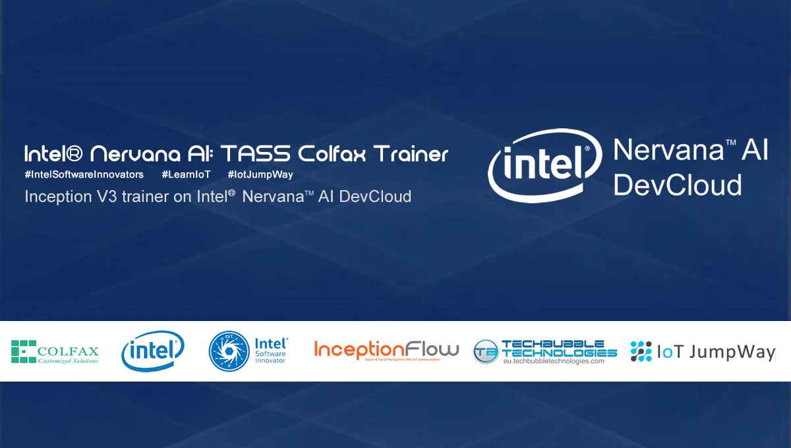

# IoT JumpWay Intel® Nervana AI / Colfax TASS Trainer

## Introduction

There have been many versions of the TASS computer vision projects over the years, one being a version built on a Raspberry Pi 3 using a program based on the Tensorflow Inception V3 transfer learning example. 

The Colfax TASS Trainer replicates the transfer learning side of the original program and is trained on the Intel Nervana AI HPC Cluster (Colfax Cluster).

## Python Versions

- Python 3 (Intel, 2018 update 1)

## Software requirements

- Intel Optimized TensorFlow (1.3.1)

## Hardware requirements

- Access to the Intel Nervana AI HPC Cluster (Colfax Cluster)

## Cloning The Repo

You will need to clone this repository to a location on your development terminal. Navigate to the directory you would like to download it to and issue the following commands.

    $ git clone https://github.com/TechBubbleTechnologies/IoT-JumpWay-Intel-Examples.git
	
Once you have the repo, you will need to find the files in this folder located in [this location](https://github.com/TechBubbleTechnologies/IoT-JumpWay-Intel-Examples/tree/master/Intel-Colfax/Tass-Trainer "this location")

## Install Requirements

Everything for this tutorial is already provided on Colfax.

## Upload Structure To Colfax

Once you have completed the steps above, it is time to login to Colfax and upload the structure described above. You need to upload all of the files shown in the screen shot below, with exception to the README.

