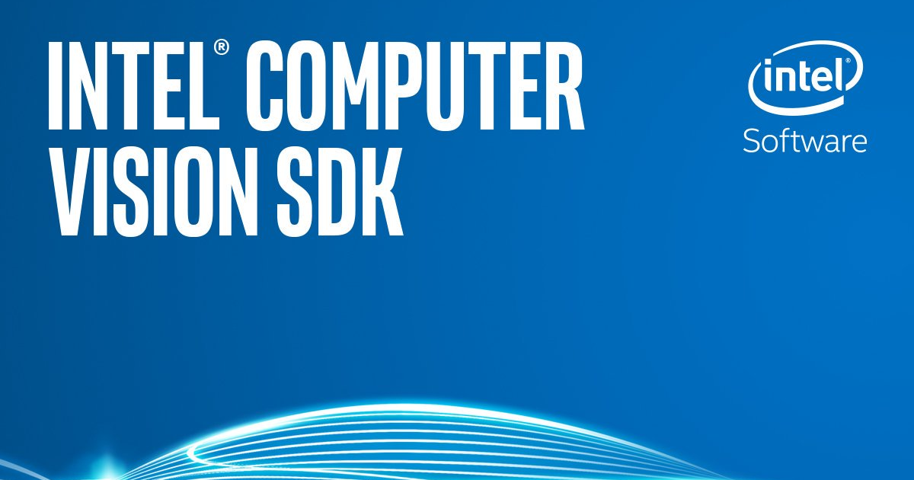

# IoT JumpWay Intel® Computer Vision SDK Examples

## Introduction

The Intel® Computer Vision SDK examples provide example projects that you can use to get started with using the TechBubble IoT JumpWay for your Intel® Computer Vision SDK projects.

## Intel® Computer Vision SDK Windows Examples

- [IoT JumpWay Intel® Computer Vision SDK Windows TASS PVL RealSense Security System](https://github.com/TechBubbleTechnologies/IoT-JumpWay-Intel-Examples/tree/master/Intel-Computer-Vision-SDK/TASS-PVL/Windows/Realsense "IoT JumpWay Intel® Computer Vision SDK Windows TASS PVL RealSense Security System")

## Intel® Computer Vision SDK Windows Docs

- [Installing Intel® Computer Vision SDK on Windows 10](https://github.com/TechBubbleTechnologies/IoT-JumpWay-Intel-Examples/blob/master/Intel-Computer-Vision-SDK/TASS-PVL/Windows/_Docs/1-Installing-Intel-CV-SDK.md "Installing Intel® Computer Vision SDK on Windows 10")

- [Installing Intel® RealSense SDK on Windows 10](https://github.com/TechBubbleTechnologies/IoT-JumpWay-Intel-Examples/blob/master/Intel-Computer-Vision-SDK/TASS-PVL/Windows/_Docs/2-Installing-Intel-RealSense-SDK.md "Installing Intel® RealSense SDK on Windows 10")

## IoT JumpWay Intel® Computer Vision SDK Bugs/Issues

Please feel free to create issues for bugs and general issues you come across whilst using the IoT JumpWay Intel® Examples. You may also use the issues area to ask for general help whilst using the IoT JumpWay Intel® Examples in your IoT projects.

## IoT JumpWay Intel® Computer Vision SDK Contributors

- [Adam Milton-Barker, TechBubble Technologies Founder](https://github.com/AdamMiltonBarker "Adam Milton-Barker, TechBubble Technologies Founder")

