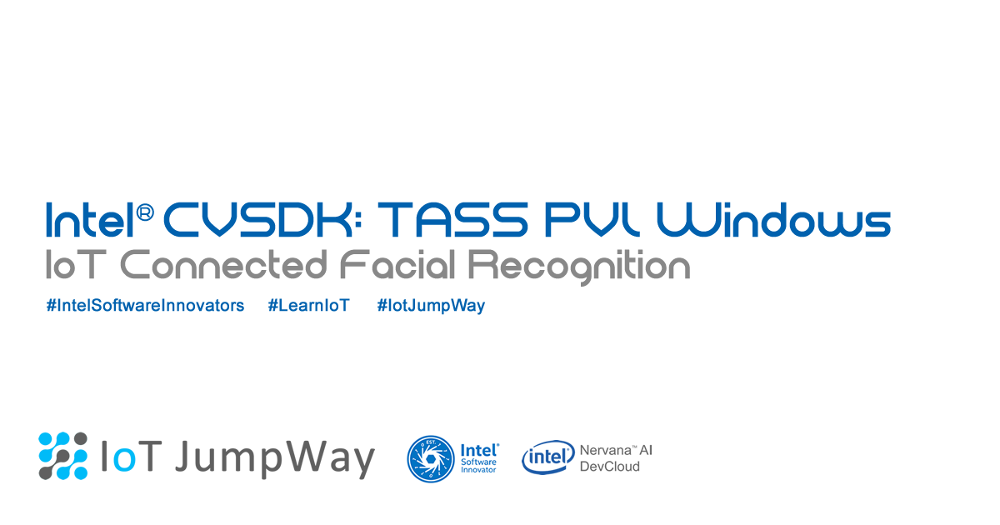
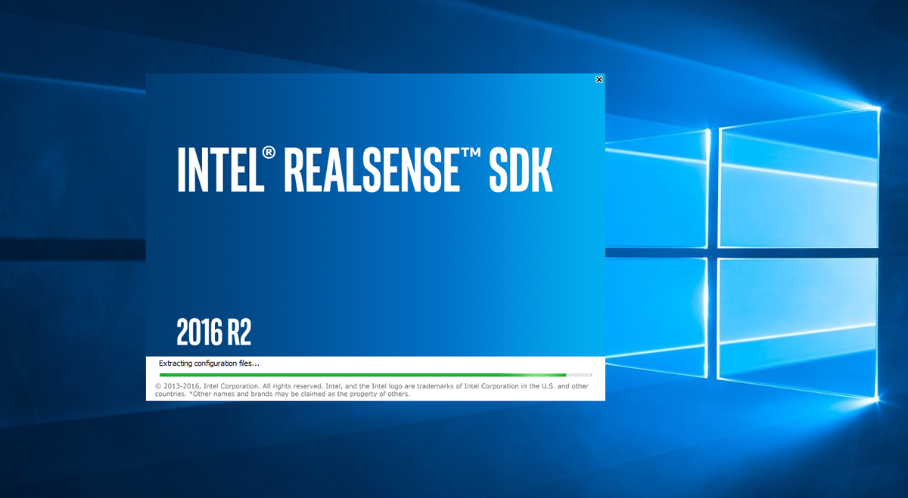
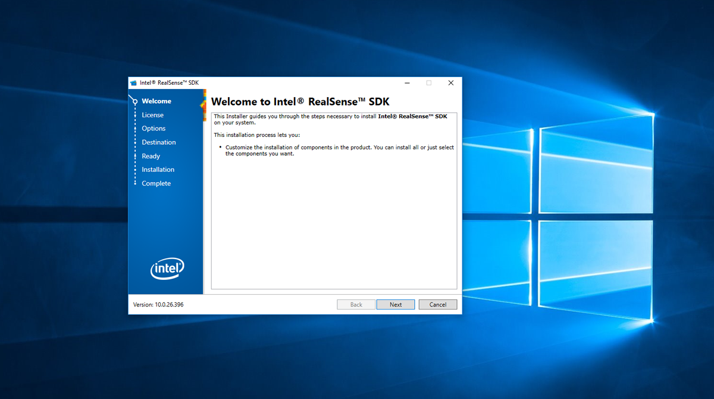
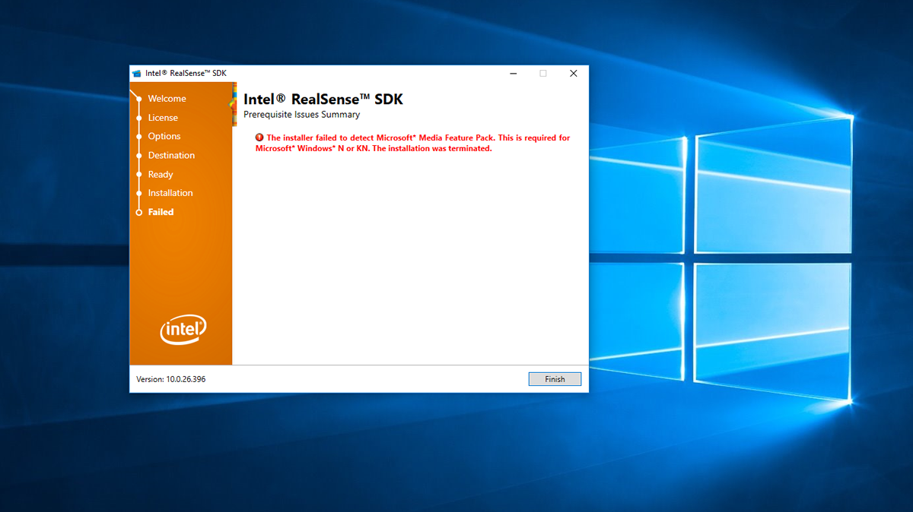
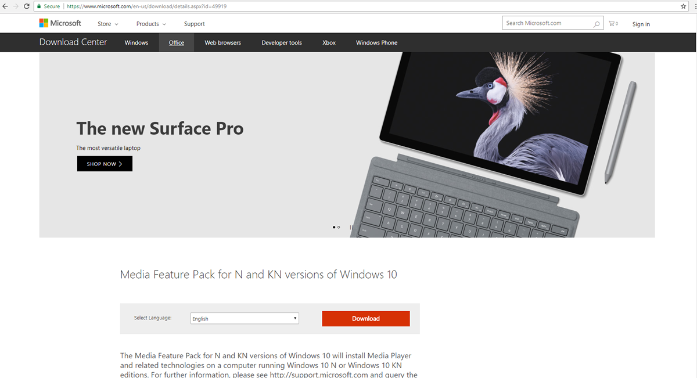
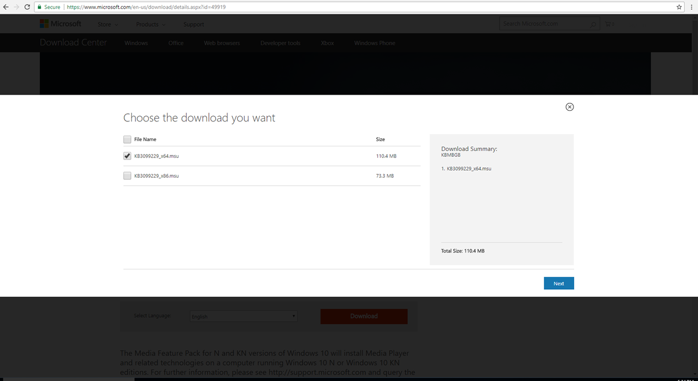
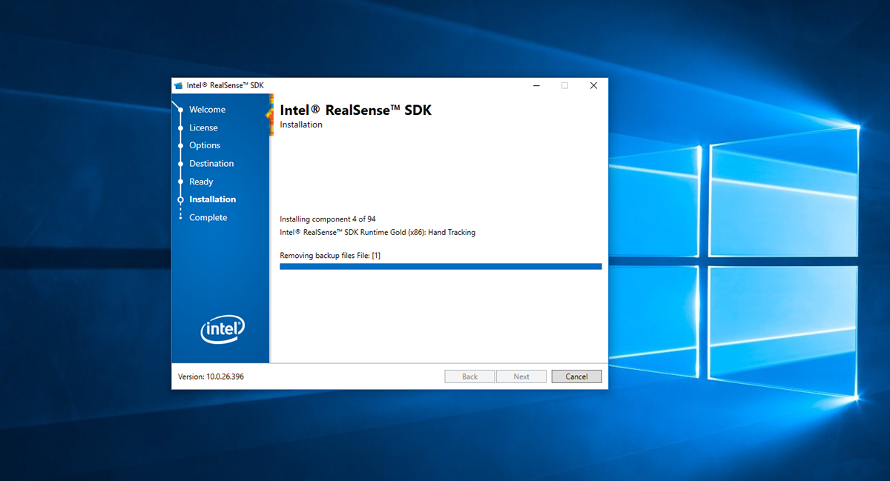
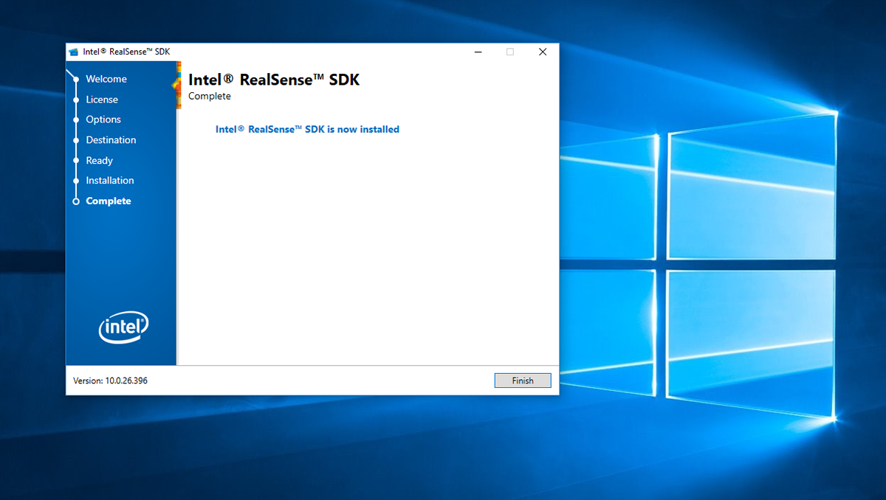

# Installing Intel® RealSense SDK on Windows 10

## Introduction

The following information will help you install the Intel® RealSense SDK on Windows 10.

## Download and install the SDK

- [Visit the Intel® RealSense SDK For Windows page for information](https://software.intel.com/en-us/realsense-sdk-windows-eol "Visit the RealSense SDK For Windows page for information")

- [Download the Intel® RealSense SDK Installer](http://registrationcenter-download.intel.com/akdlm/irc_nas/9078/intel_rs_sdk_offline_package_10.0.26.0396.exe "Download the Intel® RealSense SDK Installer")

- Install the Intel® RealSense SDK

- If you come up to the above error find the Media Feature Pack version for your version of Windows 10, in my case I am on 1703  so the version I used was [Media Feature Pack for N edition of Windows 10 Version 1703 (April 2017)](https://support.microsoft.com/en-gb/help/4016817/media-feature-pack-for-n-edition-of-windows-10-version-1703-april-2017 "Media Feature Pack for N edition of Windows 10 Version 1703 (April 2017)")

- Then restart the installation

## IoT JumpWay Intel® CV SDK Bugs/Issues

Please feel free to create issues for bugs and general issues you come across whilst using the IoT JumpWay Intel® Examples. You may also use the issues area to ask for general help whilst using the IoT JumpWay Intel® Examples in your IoT projects.

## IoT JumpWay Intel® CV SDK Examples Document Contributors

- [Adam Milton-Barker, TechBubble Technologies Founder](https://github.com/AdamMiltonBarker "Adam Milton-Barker, TechBubble Technologies Founder")

