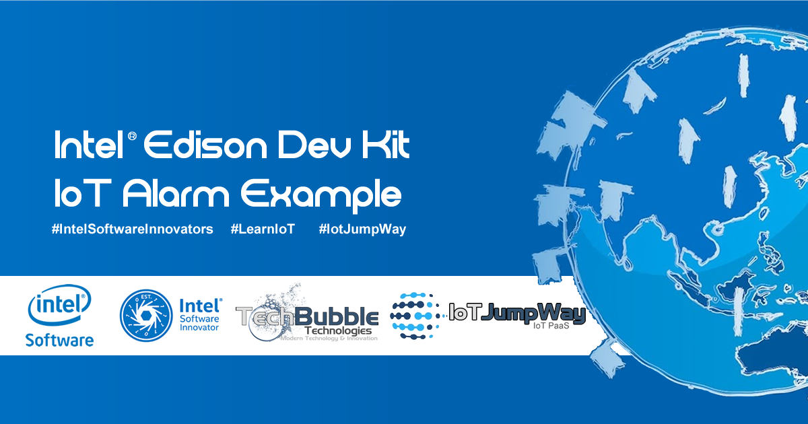
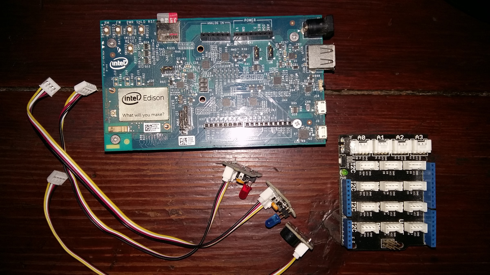

# IoT JumpWay Intel® Edison Dev Kit IoT Alarm

  

## Introduction

Here you will find sample device scripts for connecting an Intel® Edison to the TechBubble Technologies IoT JumpWay using the Node JS MQTT Client.

The tutorial will allow you to set up an IoT alarm system that is controlled by the TechBubble Technologies IoT JumpWay.

Once you understand how it works you are free to add as many actuators and sensors to your device and modify your code accordingly.

## This project uses three applications:

1. A device application (Node JS) which communicates with the IoT via the TechBubble Technologies IoT JumpWay.
2. A Python commands application that can send commands to the device to toggle the state of the LEDs and buzzer, we will use the provided Application.py.

## Python Versions

- 2.7 (Python commands application)
- 3.4 or above (Python commands application)

## Software requirements

1. [TechBubble IoT JumpWay Python MQTT Client Libraries](https://github.com/TechBubbleTechnologies/IoT-JumpWay-Python-MQTT-Clients "TechBubble IoT JumpWay Python MQTT Client Libraries")

## Hardware Requirements



1. 1x Intel® Edison
2. 1x Grove starter kit plus - Intel IoT Edition for Intel® Edison
3. 1 x Blue LED
4. 1 x Red LED
5. 1 x Buzzer

## Before You Begin

If this is the first time you have used the TechBubble IoT JumpWay in your IoT projects, you will require a developer account and some basics to be set up before you can start creating your IoT devices. Visit the following link and check out the guides (Roughly 5 minutes) that take you through registration and setting up your Location Space, Zones, Devices and Applications.

[TechBubble Technologies IoT JumpWay Developer Program (BETA) Docs](https://github.com/TechBubbleTechnologies/IoT-JumpWay-Docs/ "TechBubble Technologies IoT JumpWay Developer Program (BETA) Docs")

## Install Requirements On Your PC

1. For the Python application we will need the [TechBubble IoT JumpWay Python MQTT Client Libraries](https://github.com/TechBubbleTechnologies/IoT-JumpWay-Python-MQTT-Clients "TechBubble IoT JumpWay Python MQTT Client Libraries") installed on our PC/laptop/Mac. To Install the library, issue the following command on your chosen device:

    ```
        $ pip install techbubbleiotjumpwaymqtt
    ```

## Cloning The Repo

You will need to clone this repository to a location on your Intel® Edison. Navigate to the directory you would like to download it to and issue the following commands.

    ```
        $ git clone https://github.com/TechBubbleTechnologies/IoT-JumpWay-Intel-Examples.git
    ```

## Setting Up Your Intel® Edison


First of all you need to connect up an LED to your Intel® Edison. To connect the LED you will need an IoT Dev Kit. 

1. Connect the IoT Dev Kit to your Intel® Edison.
2. Connect the blue LED to pin D5 of your IoT Dev Kit.
3. Connect the red LED to pin D6 of your IoT Dev Kit.
3. Connect the buzzer to pin D7 of your IoT Dev Kit.

## Device / Application Connection Credentials & Sensor Settings

- Follow the [TechBubble Technologies IoT JumpWay Developer Program (BETA) Location Device Doc](https://github.com/TechBubbleTechnologies/IoT-JumpWay-Docs/blob/master/4-Location-Devices.md "TechBubble Technologies IoT JumpWay Developer Program (BETA) Location Device Doc") to set up your device, and the [TechBubble Technologies IoT JumpWay Developer Program (BETA) Location Application Doc](https://github.com/TechBubbleTechnologies/IoT-JumpWay-Docs/blob/master/5-Location-Applications.md "TechBubble Technologies IoT JumpWay Developer Program (BETA) Location Application Doc") to set up your application. 

   

- Retrieve your connection credentials and update your config.json in the IoT-JumpWay-Intel-Examples/Intel-Edison/Dev-Kit-IoT-Alarm/NodeJS directory with your new device/application connection credentials and actuator (LED,LED2,Buzzer) settings.

```
	"Actuators": {
        "LED": {
            "ID": 0,
            "PIN": 5
        },
        "LED2": {
            "ID": 0,
            "PIN": 6
        },
        "Buzzer": {
            "ID": 0,
            "PIN": 7
        }
    },
```

```
	"IoTJumpWaySettings": {
        "SystemLocation": 0,
        "SystemZone": 0,
        "SystemDeviceID": 0,
        "SystemDeviceName" : "Your Device Name",
        "SystemApplictaionID" : 0,
        "SystemApplicationName" : "Your Application Name"
	}
```

```
	"IoTJumpWayMQTTSettings": {
        "host": "iot.techbubbletechnologies.com",
        "port": "8883",
        "dUsername": "Your Device MQTT Username",
        "dPassword": "Your Device MQTT Password",
        "aUassword": "Your Application MQTT Username",
        "aPassword": "Your Application MQTT Password"
	}
```

## Execute The Programs

Make sure you are in the correct location (IoT-JumpWay-Intel-Examples/Intel-Edison/Dev-Kit-IoT-Alarm/NodeJS) and execute the following commands to start your device and application.

    $ sudo python/python3 Application.py 
    $ node index.js 

## Viewing Your Data  

Each command sent to the device is stored in the [TechBubble IoT JumpWay](https://iot.techbubbletechnologies.com/ "TechBubble IoT JumpWay"). You will be able to access the data in the [TechBubble IoT JumpWay Developers Area](https://iot.techbubbletechnologies.com/developers/dashboard/ "TechBubble IoT JumpWay Developers Area"). Once you have logged into the Developers Area, visit the [TechBubble IoT JumpWay Location Devices Page](https://iot.techbubbletechnologies.com/developers/location-devices "Location Devices page"), find your device and then visit the Commands Data page to view the data sent from your device. 


## IoT JumpWay Intel® Edison Examples Bugs/Issues

Please feel free to create issues for bugs and general issues you come across whilst using the IoT JumpWay Intel® Edison Examples. You may also use the issues area to ask for general help whilst using the IoT JumpWay Intel® Edison Examples in your IoT projects.

## IoT JumpWay Intel® Edison Examples Contributors

- [Adam Milton-Barker, TechBubble Technologies Founder](https://github.com/AdamMiltonBarker "Adam Milton-Barker, TechBubble Technologies Founder")

  