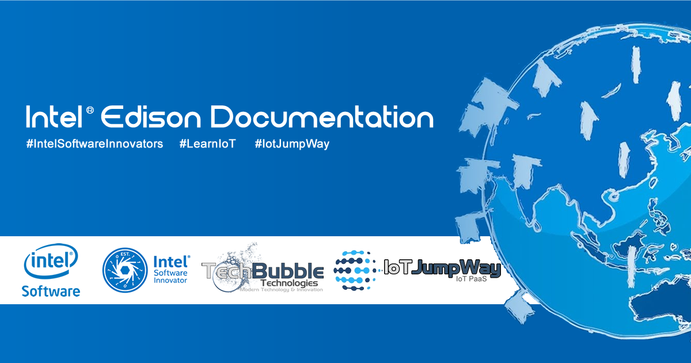

# Securing Intel® Edison Projects

    

## Introduction

The following information will help you secure your internet accessible Intel® Edison projects.

## Secure Your Router

1. This part is an absolute must! Much to our dislike, most routers are provided without any of the security features enabled. Securing your router is out of the scope of this article but you can read an article on TechBubble.info for more info:

[Is Your Router Secure ?](https://www.techbubble.info/blog/web/online-security/entry/Is-Your-Router-Secure "Is Your Router Secure ?")

## Secure Your Intel® Edison 

1. CHANGE ROOT PASSWORD: The first stage with any new device should always be to change the default password. Lists are easily accessible on the internet that give hackers the default passwords of pretty much every type of device, and if you do not change your password to a secure password anyone can easily access your device if it is connected to the internet. Once logged into the Intel® Edison via SSH issue the following command from commandline:

```
    passwd

```

You will then be asked to enter a password of a minimum of 5 characters and informed to use a combination of upper and lower case letters and numbers, you should also use symbols as well to make sure your password is as secure as possible. Re enter your new password and a confirmation will be shown that the password has been changed.

2. REGULARLY UPDATE YOUR FIRMWARE: Another important task to carry out regularly is to update your firmware. On the following link you will find some firmware updater software for your Intel® Edison that can be run from Windows, Mac and Linux, use it regularly to update your boards firmware. (https://downloadcenter.intel.com/download/24748/Intel-Galileo-Firmware-and-Drivers-1-0-4)

3. REGULARLY UPDATE YOUR PACKAGES: It is also important to update and upgrade your packages regularly. From the commandline issue the following commands:

```
    opkg update (Updates the list of available packages)

    opkg upgrade (Upgrades all available packages)

```

4. ADD A DOMAIN NAME AND SSL CERTIFICATE TO YOUR BOARD: To help ensure that data passed between your Intel® Edison and any connecting web services is encrypted, an important thing to do is to add SSL encryption to your requests. Here is the basics of completing this task.

- Ensure your local network has a static IP, you will be able to purchase one from your ISP, you can use service such as no-ip.com but this is not the preferred method.

- Ensure all ports are closed on your router with the exception of ones that you need for your applications.

- Purchase your domain name and install it on a web server, [NameCheap.com](https://www.NameCheap.com "NameCheap.com") is a great service which provides cheap domain names and SSLs, when you buy a domain name you can add an SSL for 1 year for $1.99.

- Edit the domains DNS zone file to include a sub domain, using an A record to point to the static IP of your network.

- Set up a port forwarder from your router to the IP address of the Intel® Edison.

- Login to your Galileo via SSH and generate an RSA key and a CSR that will be used to activate your SSL certificate.

- Use the following command to generate your RSA key:

```
    openssl genrsa -out ~/YOUR_CERT_FOLDER/YOUR_KEY_FILE.key 2048

```

Use the following command to generate your CSR:

```
    openssl req -new -sha256 -key ~/YOUR_CERT_FOLDER/YOUR_KEY_FILE.key -out ~/YOUR_CERT_FOLDER/YOUR_CSR_FILE.csr

```

- You will be asked a few questions at this stage, complete them all but ensure to not enter a password when prompted to, just hit enter.

- Head over to where you bought the SSL certificate from and activate your SSL cert using the CSR you generated on your Intel® Edison, once verified you will receive your SSL certificate files.

- Connect to your Galileo using SFTP, for this I always WinSCP on Windows but you can use FileZilla or the FTP client of your choice. Once connected upload your SSL cert files to your certs folder and include them in your application to ensure encrypted traffic to and from your Intel® Edison.

6. CLOSE ALL PORTS EXCEPT FOR ONES REQUIRED FOR YOUR APPLICATION: Once you have your application accessible via the internet and secured using SSL it is time to check if IPTables is installed. IPTables allows you to specify which ports are accessible on your Intel® Edison by blocking them all and allowing access to only the ports that you white list. IPTables has a lot of features and methods this is the basics:

- Check that IPTables is installed using the following command, if it is, you will see a message saying, if not it will be installed:

```
    opkg install iptables

```

- If/once installed you can check your current configs by running the following command:

```
    iptables -L or iptables -L -v

```

- Create a new config file for IPTables and modify the code to your liking. This will block all traffic to your Galileo except SSH and the specified ports you white list. To create your new config file you would issue the following command: (I am using nano but you can use your favorite text editor)

```
    nano /etc/iptables.firewall.rules

```

and then add the following code and modify to your preference:

```

    *filter

    # Allow all loopback (lo0) traffic and drop all traffic to 127/8 that doesn't use lo0

    -A INPUT -i lo -j ACCEPT

    -A INPUT -d 127.0.0.0/8 -j REJECT

    # Accept all established inbound connections

    -A INPUT -m state --state ESTABLISHED,RELATED -j ACCEPT

    # Allow all outbound traffic - you can modify this to only allow certain traffic

    -A OUTPUT -j ACCEPT

    # Allow HTTP and HTTPS connections from anywhere (the normal ports for websites and SSL).

    -A INPUT -p tcp --dport 80 -j ACCEPT

    -A INPUT -p tcp --dport 443 -j ACCEPT

    -A INPUT -p tcp --dport 8080 -j ACCEPT

    # Allow SSH connections

    #

    # The -dport number should be the same port number you set in sshd_config

    #

    -A INPUT -p tcp -m state --state NEW --dport 22 -j ACCEPT

    # Allow ping

    -A INPUT -p icmp -j ACCEPT

    # Log iptables denied calls

    -A INPUT -m limit --limit 5/min -j LOG --log-prefix "iptables denied: " --log-level 7

    # Drop all other inbound - default deny unless explicitly allowed policy

    -A INPUT -j DROP

    -A FORWARD -j DROP

    COMMIT

```

- Once you have modified and saved your config file you can then load the firewall rules by issuing the command:

```
    iptables-restore < /etc/iptables.firewall.rules

```

- To ensure that the firewall is loaded each and everytime you boot up your Intel® Edison you will need to create a new file in the network adapter hooks:

```
    nano /etc/network/if-pre-up.d/firewall

```

- make it executable:

```
    chmod +x /etc/network/if-pre-up.d/firewall

```

- Enter the following code:

```
    #!/bin/sh

    /sbin/iptables-restore < /etc/iptables.firewall.rules

```

- Reboot your Galileo and your firewall should boot up on startup everytime now.