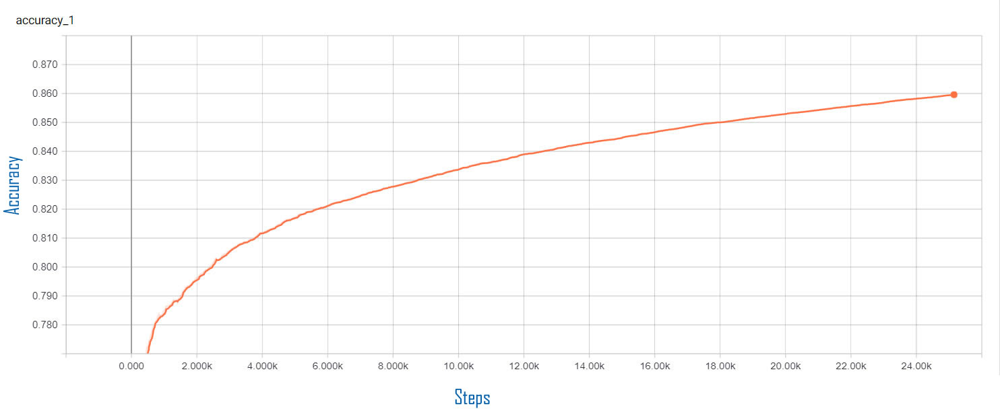
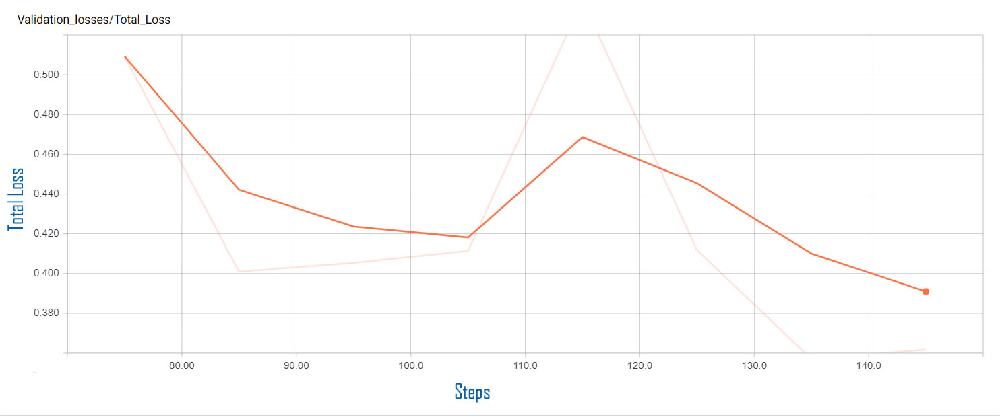

# Invasive Ductal Carcinoma (IDC) Classification Using Computer Vision & IoT
## Intel AI DevJam Demo


## Introduction

The **Intel AI DevJam Demo** project provides the source codes and tutorials for setting up the same project that will demonstrated at **Intel AI DevJam** at **ICML** (**International Conference on Machine Learning**) in **Sweden**, July 2018.

The **Intel® AI DevJam Demo** uses a **Windows application** to communicate with a **facial recognition classifier** and a classifier trained to detect **Invasive Ductal Carcinoma (Breast cancer)** in **histology images**. The project combines the  [Invasive Ductal Carcinoma (IDC) Classification Using Computer Vision & IoT](https://github.com/iotJumpway/IoT-JumpWay-Intel-Examples/tree/master/Intel-Movidius/IDC-Classification "Invasive Ductal Carcinoma (IDC) Classification Using Computer Vision & IoT") and [TASS Movidius Facenet Classifier](https://github.com/iotJumpway/IoT-JumpWay-Intel-Examples/tree/master/Intel-Movidius/TASS/Facenet "TASS Movidius Facenet Classifier") projects, along with some new improvements.

**Invasive Ductal Carcinoma (IDC) Classification Using Computer Vision & IoT** combines **Computer Vision** and the **Internet of Things** to provide a way to train a neural network with labelled breast cancer histology images to detect **Invasive Ductal Carcinoma (IDC)** in unseen/unlabelled images.

For classification the project uses the **Intel® Movidius** and a custom trained **Facenet** to carry out **facial classification**, and a custom trained **Inception V3 model** for detecting **Invasive Ductal Carcinoma (IDC)**.

The **TASS Movidius Facenet Classifier** uses **Siamese Neural Networks** and **Triplet Loss** to classify known and unknown faces.

## IoT Connectivity

**IoT connectivity** for the project is provided by the [IoT JumpWay](https://www.iotjumpway.tech "IoT JumpWay"). The **IoT JumpWay** is an **IoT communication** platform as a service (PaaS) with a social network frontend. IoT JumpWay developers will soon be able to share projects/photos/videos and events. Use of the IoT JumpWay is completely free, you can find out more on the [Developer Program](https://iot.techbubbletechnologies.com/developers/ "Developer Program") page.

## What Will We Do?


1.  Install the [Intel® NCSDK](https://github.com/movidius/ncsdk "Intel® NCSDK") on a Linux development device.
2.  Install the [Intel® NCSDK API](https://github.com/movidius/ncsdk "Intel® NCSDK API") on a Raspberry Pi 3 / UP Squared.
3.  Install the [IoT JumpWay Python MQTT Client](https://github.com/AdamMiltonBarker/JumpWayMQTT "IoT JumpWay Python MQTT Client") on the Raspberry Pi / UP Squared and configure the IoT JumpWay.
4.  Clone & set up the repo.
5.  Setup your facial recognition Model
6.  Prepare your IDC training dataset.
7.  Finetuning your IDC training parameters.
8.  Train Inception V3 IDC Classification model on Intel® AI DevCloud.
9.  Convert the model to a format suitable for the Movidius.
10.  Test the IDC classifier locally on the Linux development device.
11. Live IDC classification via the server / client.
12. Build an IoT connected alarm that will be triggered when IDC is detected.

## Applications

**Invasive Ductal Carcinoma (IDC) Classification Using Computer Vision & IoT** is made up of 6 core applications:

- **DevCloudTrainer:** A training program that allows you to train a convolutional neural network using Intel® AI DevCloud.
- **Evaluator:** An evaluation program for evaluating your model.
- **Classifier:** A classification program for testing your model.
- **Server/API:** A server that powers a REST Api, providing access to the classifier.
- **Universal Windows Application:** A Universal Windows Application for training, managing and querying (inference) The classifier server.
- **IoT Connected Alarm:** An IoT connected alarm that is triggered when IDC or an unauthorized user is detected.

## Python Versions

- Tested in Python 3.5

## Software Requirements

- [Intel® NCSDK](https://github.com/movidius/ncsdk "Intel® NCSDK")
- [Tensorflow 1.4.0](https://www.tensorflow.org/install "Tensorflow 1.4.0")
- [IoT JumpWay Python MQTT Client](https://github.com/iotJumpway/JumpWayMQTT "IoT JumpWay Python MQTT Client")
- [GrovePi](https://github.com/DexterInd/GrovePi "GrovePi")

## Hardware Requirements

- 1 x [Free Access to Intel® AI DevCloud](https://software.intel.com/en-us/ai-academy/tools/devcloud "Free Access to Intel® AI DevCloud")
- 1 x [Intel® Movidius](https://www.movidius.com/ "Intel® Movidius")
- 1 x Linux Device for training & converting the trained model to a Movidius friendly model.
- 1 x Raspberry Pi 3 / UP Squared for the classifier / server.
- 1 x Raspberry Pi 3 for IoT connected alarm.
- 1 x Grove starter kit for IoT, Raspberry Pi edition.
- 1 x Blue LED (Grove)
- 1 x Red LED (Grove)
- 1 x Buzzer (Grove)

## Install NCSDK On Your Development Device


The first thing you will need to do is to install the **NCSDK** on your development device, this will be used to convert the trained model into a format that is compatible with the Movidius.

```
 $ mkdir -p ~/workspace
 $ cd ~/workspace
 $ git clone https://github.com/movidius/ncsdk.git
 $ cd ~/workspace/ncsdk
 $ make install
```

Next plug your Movidius into your device and issue the following commands:

```
 $ cd ~/workspace/ncsdk
 $ make examples
```

## Install NCSDK On Your Raspberry Pi 3 / UP Squared

Next you will need to install the **NCSDK** on your **Raspberry Pi 3** / **UP Squared** device, this will be used by the classifier to carry out inference on local images or images received via the API we will create. Make sure you have the Movidius plugged in.

```
 $ mkdir -p ~/workspace
 $ cd ~/workspace
 $ git clone https://github.com/movidius/ncsdk.git
 $ cd ~/workspace/ncsdk/api/src
 $ make
 $ sudo make install
```
```
 $ cd ~/workspace
 $ git clone https://github.com/movidius/ncappzoo
 $ cd ncappzoo/apps/hello_ncs_py
 $ python3 hello_ncs.py
```

## Getting Started With The IoT JumpWay

There are a few tutorials that you should follow before beginning, especially if it is the first time you have used the **IoT JumpWay Developer Program**. If you do not already have one, you will require an **IoT JumpWay Developer Program developer account**, and some basics to be set up before you can start creating your IoT devices. Visit the following [IoT JumpWay Developer Program Docs (5-10 minute read/setup)](https://github.com/iotJumpWay/IoT-JumpWay-Docs/ "IoT JumpWay Developer Program Docs (5-10 minute read/setup)") and check out the guides that take you through registration and setting up your Location Space, Zones, Devices and Applications (About 5 minutes read).

## IoT JumpWay Device Connection Credentials & Settings

- Setup an IoT JumpWay Location Device for IDC Classifier, ensuring you set up a camera node, as you will need the ID of the dummy camera for the project to work. Once your create your device add the location ID and Zone ID to the **IoTJumpWay** details in the confs file located at **required/confs.json**, also add the device ID and device name exactly, add the MQTT credentials to the **IoTJumpWayMQTT** .

You will need to edit your device and add the rules that will allow it to communicate autonomously with the other devices and applications on the network, but for now, these are the only steps that need doing at this point.

Follow the [IoT JumpWay Developer Program (BETA) Location Device Doc](https://github.com/iotJumpWay/IoT-JumpWay-Docs/blob/master/4-Location-Devices.md "IoT JumpWay Developer Program (BETA) Location Device Doc") to set up your devices.

```
{
    "IoTJumpWay": {
        "Location": 0,
        "Zone": 0,
        "Device": 0,
        "DeviceName" : "",
        "App": 0,
        "AppName": ""
    },
    "Actuators": {},
    "Cameras": [
        {
            "ID": 0,
            "URL": 0,
            "Name": ""
        }
    ],
    "Sensors": {},
	"IoTJumpWayMQTT": {
        "MQTTUsername": "",
        "MQTTPassword": ""
    },
    "ClassifierSettings":{
        "dataset_dir":"model/train/",
        "log_dir":"model/_logs",
        "log_eval":"model/_logs_eval",
        "classes":"model/classes.txt",
        "labels":"labels.txt",
        "labels_file":"model/train/labels.txt",
        "validation_size":0.3,
        "num_shards":2,
        "random_seed":50,
        "tfrecord_filename":"200label",
        "file_pattern":"200label_%s_*.tfrecord",
        "image_size":299,
        "num_classes":2,
        "num_epochs":60,
        "dev_cloud_epochs":40,
        "test_num_epochs":1,
        "batch_size":10,
        "test_batch_size":36,
        "initial_learning_rate":0.0001,
        "learning_rate_decay_factor":0.96,
        "num_epochs_before_decay":10,
        "NetworkPath":"",
        "InceptionImagePath":"model/test/",
        "InceptionThreshold": 0.54,
        "InceptionGraph":"model/idc.graph",
        "InceptionGraphDevCloud":"model/idcdc.graph",
        "Graph":"model/tass.graph",
        "Dlib":"model/dlib/shape_predictor_68_face_landmarks.dat",
        "dataset_dir":"model/train/",
        "TestingPath":"data/testing/",
        "ValidPath":"data/known/"
    }
}
```

## Cloning The Repo

You will need to clone this repository to a location on your development terminal. Navigate to the directory you would like to download it to and issue the following commands.

    $ git clone https://github.com/iotJumpway/IoT-JumpWay-Microsoft-Examples.git

Once you have the repo, you will need to find the files in this folder located in [IoT-JumpWay-Microsoft-Examples/Intel-AI-DevJam-IDC/IDC-Classifier](https://github.com/iotJumpway/IoT-JumpWay-Microsoft-Examples/tree/master/Intel-AI-DevJam-IDC/IDC-Classifier "IoT-JumpWay-Microsoft-Examples/Intel-AI-DevJam-IDC/IDC-Classifier").

## Setup Your Facial Recognition Model

First of all you need to setup the facial recognition capabilities for the project. For this you can use the **setup.sh** file provided. Assuming you are in the **IoT-JumpWay-Microsoft-Examples/Intel-AI-DevJam-IDC/IDC-Classifier** directory, **make sure you have you have your Movidius plugged in** and run the following command from terminal:

```
 $ sed -i 's/\r//' setup.sh
 $ sh setup.sh
```

This do the following:

- Install the required packages named in **requirements.txt**
- Downloads the pretrained **Facenet** model (**davidsandberg/facenet**)
- Downloads the pretrained **Inception V3** model
- Converts the Facenet model to a model that is compatible with the **Intel® Movidius**

## Preparing Your Facial Recognition Dataset

You need to set up two very small datasets. As we are using a pretrained **Facenet** model there is no training to do in this tutorial and we only need one image per known person. You should see the **known** and **testing** folders in the **data** directory, this is where you will store 1 image of each person you want to be identified by the network, and also a testing dataset that can include either known or unknown faces for testing. When you store the known data, you should name each image with the name you want them to be identified as in the system, in my testing I used images of me and two other random people, the 1 image used to represent myself in the known folder was named Adam.

## Preparing Your IDC Training Data

For this tutorial, I used a dataset from Kaggle ( [Predict IDC in Breast Cancer Histology Images](https://www.kaggle.com/paultimothymooney/predict-idc-in-breast-cancer-histology-image "Predict IDC in Breast Cancer Histology Images") ), but you are free to use any dataset you like. I have uploaded the collection I used for positive and negative images which you will find in the **model/train** directory. Once you decide on your dataset you need to arrange your data into the **model/train** directory. Each subdirectory should be named with integers, I used 0 and 1 to represent positive and negative. In my testing I used 4400 positive and 4400 negative examples giving an overall training accuracy of 0.8596 (See Training Results below) and an average confidence of 0.96 on correct identifications. The data provided is 50px x 50px, as Inception V3 was trained on images of size 299px x 299px, the images are resized to 299px x 299px, ideally the images would be that size already so you may want to try different datasets and see how your results vary.

## Finetuning Your Training Parameters

You can finetune the settings of the network at any time by editing the classifier settings in the **required/confs.json** file.

```
"ClassifierSettings":{
    "dataset_dir":"model/train/",
    "log_dir":"model/_logs",
    "log_eval":"model/_logs_eval",
    "classes":"model/classes.txt",
    "labels":"labels.txt",
    "labels_file":"model/train/labels.txt",
    "validation_size":0.3,
    "num_shards":2,
    "random_seed":50,
    "tfrecord_filename":"200label",
    "file_pattern":"200label_%s_*.tfrecord",
    "image_size":299,
    "num_classes":2,
    "num_epochs":60,
    "dev_cloud_epochs":40,
    "test_num_epochs":1,
    "batch_size":10,
    "test_batch_size":36,
    "initial_learning_rate":0.0001,
    "learning_rate_decay_factor":0.96,
    "num_epochs_before_decay":10,
    "NetworkPath":"",
    "InceptionImagePath":"model/test/",
    "InceptionThreshold": 0.54,
    "InceptionGraph":"model/idc.graph",
    "InceptionGraphDevCloud":"model/idcdc.graph",
    "Graph":"model/tass.graph",
    "Dlib":"model/dlib/shape_predictor_68_face_landmarks.dat",
    "dataset_dir":"model/train/",
    "TestingPath":"data/testing/",
    "ValidPath":"data/known/"
}
```

## Training Your IDC Model On Intel® AI DevCloud

Now you are ready to upload the files and folders outlined below to AI DevCloud.

```
model
tools
DevCloudTrainer.ipynb
DevCloudTrainer.py
Eval.py
```

Once uploaded, follow the instructions in **DevCloudTrainer.ipynb**, this notebook will help you sort your data, train your model and evaluate it.

## Training Results




## Evaluating Your Model

Once you have completed your training on the AI DevCloud, complete the notebook by running the evaluation job.

```
INFO:tensorflow:Global Step 1: Streaming Accuracy: 0.0000 (2.03 sec/step)
INFO:tensorflow:Global Step 2: Streaming Accuracy: 0.8889 (0.59 sec/step)
INFO:tensorflow:Global Step 3: Streaming Accuracy: 0.8750 (0.67 sec/step)
INFO:tensorflow:Global Step 4: Streaming Accuracy: 0.8981 (0.65 sec/step)
INFO:tensorflow:Global Step 5: Streaming Accuracy: 0.8681 (0.76 sec/step)
INFO:tensorflow:Global Step 6: Streaming Accuracy: 0.8722 (0.64 sec/step)
INFO:tensorflow:Global Step 7: Streaming Accuracy: 0.8843 (0.64 sec/step)

-------------------------------------------------------------------------

INFO:tensorflow:Global Step 68: Streaming Accuracy: 0.8922 (0.81 sec/step)
INFO:tensorflow:Global Step 69: Streaming Accuracy: 0.8926 (0.70 sec/step)
INFO:tensorflow:Global Step 70: Streaming Accuracy: 0.8921 (0.63 sec/step)
INFO:tensorflow:Global Step 71: Streaming Accuracy: 0.8929 (0.84 sec/step)
INFO:tensorflow:Global Step 72: Streaming Accuracy: 0.8932 (0.75 sec/step)
INFO:tensorflow:Global Step 73: Streaming Accuracy: 0.8935 (0.61 sec/step)
INFO:tensorflow:Global Step 74: Streaming Accuracy: 0.8942 (0.67 sec/step)
INFO:tensorflow:Final Streaming Accuracy: 0.8941
```




## Download Your Model

When the training completes you need to download **model/DevCloudIDC.pb** and **model/classes.txt** to the **model** directory on your development machine, ensure the Movidius is setup and connected and then run the following commands on your development machine:

```
$ cd ~/IoT-JumpWay-Microsoft-Examples/Intel-AI-DevJam-IDC/IDC-Classifier
$ ./DevCloudTrainer.sh
```

The contents of DevCloudTrainer.sh are as follows:

```
#IDC Classification Trainer
mvNCCompile model/DevCloudIDC.pb -in=input -on=InceptionV3/Predictions/Softmax -o igraph
python3.5 Classifier.py Inception
python3.5 Classifier.py Facenet
```

1. Compile the model for Movidius
2. Test the Inception V3 model
3. Test the Facenet model

## Testing Your IDC & Facial Recognition Models

Once the graphs have been compiled a testing program will start for each of the two classifiers/graphs. 

In the **IDC** example there are two classes 0 and 1 (**IDC negative** & **IDC positive**), a classification of 0 shows that the AI thinks the image is not IDC positive, and a classification of 1 is positive.

```
!! Welcome to the Intel AI DevJam Classifier, please wait while the program initiates !!

-- Running on Python 3.5.2 (default, Nov 23 2017, 16:37:01)
[GCC 5.4.0 20160609]

-- Imported Required Modules
-- Setup Environment Settings
-- Movidius Connected
-- Initiating JumpWayMQTT Device
-- JumpWayMQTT Device Initiated
-- JumpWayMQTT Device Connection Initiating
-- JumpWayMQTT Device Connection Initiated
-- IoT JumpWay Initiated
-- Classifier Initiated
-- Allocated Inception V3 Graph OK
-- JumpWayMQTT Device Connected
rc: 0
-- Published to Device Status
-- Published: 1
-- IDC Categories Loaded OK: 2
-- INCEPTION V3 TEST MODE STARTED: :  2018-06-09 08:36:21.539925
-- Loaded Test Image model/test/negative.png
-- DETECTION STARTING
-- STARTED: :  2018-06-09 08:36:21.551393
-- DETECTION ENDING
-- ENDED:  2018-06-09 08:36:23.460571
-- TIME: 1.909158706665039

!! TASS Did Not Identify IDC

-- Published to Device Warnings Channel

-- Published: 2
-- Published to Device Sensors Channel
-- Loaded Test Image model/test/positive.png
-- Published: 3
-- DETECTION STARTING
-- STARTED: :  2018-06-09 08:36:23.470298
-- DETECTION ENDING
-- ENDED:  2018-06-09 08:36:25.349699
-- TIME: 1.8793988227844238

!! TASS Identified IDC with a confidence of 0.945

-- Published: 4
-- Published to Device Warnings Channel

-- Published: 5
-- Published to Device Sensors Channel

-- INCEPTION V3 TEST MODE ENDING
-- ENDED:  2018-06-09 08:36:25.353735
-- TESTED:  2
-- IDENTIFIED:  1
-- TIME(secs): 3.813807725906372

!! SHUTTING DOWN !!
```

In the **Facenet** example the program will first loop through your testing images, and once it sees a face it will loop through all of the known faces and match them against the faces, once it finds a match, or not, it will move on to the next image in your testing loop until all images have been classifier as known or unknown. 

```
!! Welcome to the Intel AI DevJam Classifier, please wait while the program initiates !!

-- Running on Python 3.5.2 (default, Nov 23 2017, 16:37:01)
[GCC 5.4.0 20160609]

-- Imported Required Modules
-- Setup Environment Settings
-- Movidius Connected
-- Initiating JumpWayMQTT Device
-- JumpWayMQTT Device Initiated
-- JumpWayMQTT Device Connection Initiating
-- JumpWayMQTT Device Connection Initiated
-- IoT JumpWay Initiated
-- Classifier Initiated
-- Allocated Facenet Graph OK
-- JumpWayMQTT Device Connected
rc: 0
-- Published to Device Status
-- Published: 1
-- IDC Categories Loaded OK: 2
-- FACENET TEST MODE STARTING
-- STARTED:  2018-06-09 08:44:36.233488
-- Total Difference is: 1.1339170932769775
-- MATCH Adam-3.jpg
-- Published to Device Warnings Channel
-- Published: 2
-- Total Difference is: 0.8448524475097656
-- MATCH Adam-2.jpg
-- Published to Device Warnings Channel
-- Published: 3
-- Total Difference is: 0.8118671178817749
-- MATCH Adam-6.jpg
-- Published to Device Warnings Channel
-- Published: 4
-- Total Difference is: 0.8795345425605774
-- MATCH Adam-4.jpg
-- Published to Device Warnings Channel
-- Published: 5
-- Total Difference is: 1.0212488770484924
-- MATCH Adam-5.jpg
-- Published to Device Warnings Channel

-- FACENET TEST MODE ENDING
-- ENDED:  2018-06-09 08:44:37.861255
-- TESTED:  5
-- IDENTIFIED:  5
-- TIME(secs): 1.6278088092803955

!! SHUTTING DOWN !!
```

## Serving Your Live IDC Model

Now that we are all trained and tested, it is time to set up the server that will serve an **API** that provides access to your trained models. The Universal Windows Application will use this API to interact with the AI for training / classifying etc.

- **Server.py** starts an **Rest api server** with **API endpoints** for both your **IDC** and **Facenet** classifiers.
- **Client.py** is provided to test sending images via HTTP to the API to receive a classification.

The server is currently set to start up on localhost, if you would like to change this you need to edit line 281 of **Server.py** and line 38 of **Client.py** to match your desired host. Once you have things working, if you are going to be leaving this running and access it from the outside world you shoud secure it with LetsEncrypt or similar.

Upload the following files and folders to the UP Squared or Raspberry Pi 3 that you are going to use for the server.

```
data/captured/
data/known/
data/testing/
model/test/
model/classes.txt
required/confs.json
tools

Client.py
Server.py
```

4. Open up a terminal and navigate to the to the folder containing Server.py then issue the following command. This will start the server and wait to receive images for classification.

```
$ python3.5 Server.py
```

```
!! Welcome to Intel AI DevJam Classification Server, please wait while the program initiates !!

-- Running on Python 3.5.2 (default, Nov 23 2017, 16:37:01)
[GCC 5.4.0 20160609]
-- Imported Required Modules
-- API Initiating
-- API Intiated
-- Initiating JumpWayMQTT Device
-- JumpWayMQTT Device Initiated
-- JumpWayMQTT Device Connection Initiating
-- JumpWayMQTT Device Connection Initiated
-- IoT JumpWay Initiated
-- Classifier Initiated
 * Running on http://###.###.#.##:####/ (Press CTRL+C to quit)
-- JumpWayMQTT Device Connected
rc: 0
-- Published to Device Status
-- Published: 1

```

5. If you have followed all of the above steps, you can now start the client with the following commands:

```
$ python3.5 Client.py
```

This will send a positive and negative histology slides and test faces to the Raspberry Pi 3 / UP Squared which will return the predictions.

```
!! Welcome to Intel AI DevJam IDC Demo Classification Client, please wait while the program initiates !!

-- Running on Python 3.5.2 (default, Nov 23 2017, 16:37:01)
[GCC 5.4.0 20160609]
-- Imported Required Modules
-- IDC Classification Client Initiated

-- Using IDC Classification
-- Testing Dir: model/test/
-- Sending model/test/negative.png
{'Response': 'OK', 'ResponseMessage': 'IDC Not Detected!', 'Results': 0}
-- Testing Dir: model/test/
-- Sending model/test/positive.png
{'Response': 'OK', 'ResponseMessage': 'IDC Detected!', 'Results': 1}

-- Using TASS Classification
-- Testing Dir: data/testing/
-- Sending data/testing/Adam-3.jpg
{'Response': 'OK', 'ResponseMessage': 'adam.jpg Detected', 'Results': 1}
-- Testing Dir: data/testing/
-- Sending data/testing/Adam-2.jpg
{'Response': 'OK', 'ResponseMessage': 'adam.jpg Detected', 'Results': 1}
-- Testing Dir: data/testing/
-- Sending data/testing/Adam-6.jpg
{'Response': 'OK', 'ResponseMessage': 'adam.jpg Detected', 'Results': 1}
-- Testing Dir: data/testing/
-- Sending data/testing/Adam-4.jpg
{'Response': 'OK', 'ResponseMessage': 'adam.jpg Detected', 'Results': 1}
-- Testing Dir: data/testing/
-- Sending data/testing/Adam-5.jpg
{'Response': 'OK', 'ResponseMessage': 'adam.jpg Detected', 'Results': 1}
-- Testing Dir: data/testing/

```

```
!! Welcome to Intel AI DevJam Classification Server, please wait while the program initiates !!

-- Running on Python 3.5.2 (default, Nov 23 2017, 16:37:01)
[GCC 5.4.0 20160609]
-- Imported Required Modules
-- API Initiating
-- API Intiated
-- Initiating JumpWayMQTT Device
-- JumpWayMQTT Device Initiated
-- JumpWayMQTT Device Connection Initiating
-- JumpWayMQTT Device Connection Initiated
-- IoT JumpWay Initiated
-- Classifier Initiated
 * Running on http://###.###.#.##:7455/ (Press CTRL+C to quit)
-- JumpWayMQTT Device Connected
rc: 0
-- Published to Device Status
-- Published: 1
-- Movidius Connected
-- Allocated IDC Graph OK
-- IDC Categories Loaded OK: 2
-- INCEPTION V3 IDC INFERENCE STARTED:  2018-06-09 20:28:37.211762

Server.py:294: DeprecationWarning: The binary mode of fromstring is deprecated, as it behaves surprisingly on unicode inputs. Use frombuffer instead
  nparr = np.fromstring(r.data, np.uint8)
-- Loading Sample
-- Loaded Sample
-- IDC DETECTION STARTED: :  2018-06-09 20:28:37.225669

-- IDC DETECTION ENDED:  2018-06-09 20:28:39.135479
-- TIME: 1.9098103046417236
!! TASS Did Not Identify IDC
-- Published to Device Warnings Channel
-- Published: 2
-- Published to Device Sensors Channel
-- Published: 3

-- INCEPTION V3 LIVE INFERENCE ENDING
-- ENDED:  2018-06-09 20:28:39.638233
-- TESTED:  1
-- IDENTIFIED:  0
-- TIME(secs): 2.426482677459717

###.###.#.## - - [09/Jun/2018 20:28:39] "POST /api/IDC/infer HTTP/1.1" 200 -
-- Movidius Connected
-- Allocated IDC Graph OK
-- IDC Categories Loaded OK: 4
-- INCEPTION V3 IDC INFERENCE STARTED:  2018-06-09 20:28:40.305284

-- Loading Sample
-- Loaded Sample
-- IDC DETECTION STARTED: :  2018-06-09 20:28:40.315430

-- IDC DETECTION ENDED:  2018-06-09 20:28:42.224892
-- TIME: 1.9094266891479492
!! TASS Identified IDC with a confidence of 0.945
-- Published: 4
-- Published to Device Warnings Channel

-- Published: 5
-- Published to Device Sensors Channel

-- INCEPTION V3 LIVE INFERENCE ENDING
-- ENDED:  2018-06-09 20:28:42.729121
-- TESTED:  1
-- IDENTIFIED:  1
-- TIME(secs): 2.423848867416382

###.###.#.## - - [09/Jun/2018 20:28:42] "POST /api/IDC/infer HTTP/1.1" 200 -
-- Movidius Connected
-- Allocated TASS Graph OK
-- FACENET LIVE INFERENCE STARTED:  2018-06-09 20:28:43.495818
Server.py:197: DeprecationWarning: The binary mode of fromstring is deprecated, as it behaves surprisingly on unicode inputs. Use frombuffer instead
  nparr = np.fromstring(r.data, np.uint8)
-- Loading Face
-- Loaded Sample
-- Total Difference is: 1.1347997188568115
-- MATCH adam.jpg
-- Published: 6
-- Published to Device Warnings Channel

-- FACENET LIVE INFERENCE ENDED:  2018-06-09 20:28:43.910364
-- TESTED:  1
-- IDENTIFIED:  1
-- TIME(secs): 0.4145240783691406

###.###.#.## - - [09/Jun/2018 20:28:44] "POST /api/TASS/infer HTTP/1.1" 200 -
-- Movidius Connected
-- Allocated TASS Graph OK
-- FACENET LIVE INFERENCE STARTED:  2018-06-09 20:28:45.242851
-- Loading Face
-- Loaded Sample
-- Total Difference is: 0.8408797383308411
-- MATCH adam.jpg
-- Published to Device Warnings Channel
-- Published: 7

-- FACENET LIVE INFERENCE ENDED:  2018-06-09 20:28:45.715089
-- TESTED:  1
-- IDENTIFIED:  1
-- TIME(secs): 0.47223973274230957

###.###.#.## - - [09/Jun/2018 20:28:46] "POST /api/TASS/infer HTTP/1.1" 200 -
-- Movidius Connected
-- Allocated TASS Graph OK
-- FACENET LIVE INFERENCE STARTED:  2018-06-09 20:28:46.972748
-- Loading Face
-- Loaded Sample
-- Total Difference is: 0.8204063177108765
-- MATCH adam.jpg
-- Published: 8
-- Published to Device Warnings Channel

-- FACENET LIVE INFERENCE ENDED:  2018-06-09 20:28:47.393894
-- TESTED:  1
-- IDENTIFIED:  1
-- TIME(secs): 0.4211585521697998

###.###.#.## - - [09/Jun/2018 20:28:47] "POST /api/TASS/infer HTTP/1.1" 200 -
-- Movidius Connected
-- Allocated TASS Graph OK
-- FACENET LIVE INFERENCE STARTED:  2018-06-09 20:28:48.622162
-- Loading Face
-- Loaded Sample
-- Total Difference is: 0.8851813673973083
-- MATCH adam.jpg
-- Published: 9
-- Published to Device Warnings Channel

-- FACENET LIVE INFERENCE ENDED:  2018-06-09 20:28:49.001635
-- TESTED:  1
-- IDENTIFIED:  1
-- TIME(secs): 0.3794584274291992

###.###.#.## - - [09/Jun/2018 20:28:49] "POST /api/TASS/infer HTTP/1.1" 200 -
-- Movidius Connected
-- Allocated TASS Graph OK
-- FACENET LIVE INFERENCE STARTED:  2018-06-09 20:28:50.269028
-- Loading Face
-- Loaded Sample
-- Total Difference is: 1.017368733882904
-- MATCH adam.jpg
-- Published: 10
-- Published to Device Warnings Channel

-- FACENET LIVE INFERENCE ENDED:  2018-06-09 20:28:50.666370
-- TESTED:  1
-- IDENTIFIED:  1
-- TIME(secs): 0.397350549697876

###.###.#.## - - [09/Jun/2018 20:28:51] "POST /api/TASS/infer HTTP/1.1" 200 -

```

## Build an IoT connected alarm


The next step is to set up your Raspberry Pi 3 so that the IDC server can communicate with it via the IoT JumpWay. For this, I already created a tutorial for the IoT JumpWay Raspberry Pi Dev Kit IoT Alarm that will guide you through this process. The only difference is that you do not need to set up the Python commands application, as in this project, the IDC server will replace the Python commands application, to save time, please only follow the steps for Device.py and not Application.py. You will need to uncomment lines 104 - 107 to ensure that the LEDs and buzzer turn off after some time, you can update line 107 to set the amount of time to keep them running for.

You will find the tutorial on the following link: [IoT JumpWay Raspberry Pi Dev Kit IoT Alarm](https://github.com/iotJumpway/IoT-JumpWay-RPI-Examples/tree/master/Dev-Kit-IoT-Alarm/Python "IoT JumpWay Raspberry Pi Dev Kit IoT Alarm")

Once you have completed that tutorial and have your device setup, return here to complete the final integration steps.

## Setting Up Your Rules

You are now ready to take the final steps, at this point you should have everything set up and your Raspberry Pi Dev Kit IoT Alarm should be running and connected to the IoT JumpWay waiting for instructions.

Next we are going to set up the rules that allow the IDC server to control your Raspberry Pi Dev Kit IoT Alarm autonomously. Go back to the IDC device edit page. Scroll down to below where you added the camera node and you will see you are able to add rules.


The rules that we want to add are as follows:

1. When IDC is identified, turn on the red LED.

2. When IDC is identified, turn on the buzzer.

3. When IDC is not identified, turn on the blue LED.

The events are going be triggered by warning messages sent from the IDC classifier / server, so in the **On Event Of** drop down, select **WARNING**. Then you need to select the camera node you added to the IDC device, as this is the sensor that the warning will come from. Next choose **RECOGNISED** in the **With Warning Of**, which will mean that the rule will be triggered when the IoT JumpWay receives a warning message that IDC has been identified, then select the **Send Device Command** for the **Take The Following Action** section, choose the Raspberry Pi Dev Kit IoT Alarm as the device, the red LED as the sensor/actuator, **TOGGLE** as the action and on as the command. This will then tell the Raspberry Pi  to turn on the red light in the event of IDC being detected, repeat this process for the buzzer. Finally repeat the LED command for the blue LED but with **NOT RECOGNISED** in the **With Warning Of** and selecting the ID that represents the blue LED you set up on the Raspberry Pi.

## Viewing Your Data

When the program processes an image, it will send sensor & warning data where relevant to the [IoT JumpWay](https://iot.techbubbletechnologies.com/ "IoT JumpWay"). You will be able to access the data in the [IoT JumpWay Developers Area](https://iot.techbubbletechnologies.com/developers/dashboard/ "IoT JumpWay Developers Area"). Once you have logged into the Developers Area, visit the [IoT JumpWay Location Devices Page](https://iot.techbubbletechnologies.com/developers/location-devices "Location Devices page"), find your device and then visit the Sensor Data pages to view the data sent from the device. You can also view command messages for the Raspberry Pi in the Raspberry Pi device page under the Commands tab.


# DISCLAIMER

The purpose of the tutorial and source code for **Invasive Ductal Carcinoma (IDC) Classification Using Computer Vision & IoT** is to help people learn how to create computer vision projects and for people interested in the medical use case evaluate if it may help them and to expand upon. Although the the program is fairly accurate in testing, this project is not meant to be an alternative for use instead of seeking professional help. I am a developer not a doctor or expert on cancer.

- **Acknowledgement:** Uses code from Intel® **movidius/ncsdk** ([movidius/ncsdk Github](https://github.com/movidius/ncsdk "movidius/ncsdk Github"))
- **Acknowledgement:** Uses code from chesterkuo **imageclassify-movidius** ([imageclassify-movidius Github](https://github.com/chesterkuo/imageclassify-movidius "imageclassify-movidius Github"))

## Bugs/Issues

Please feel free to create issues for bugs and general issues you come across whilst using this or any other IoT JumpWay Microsoft repo issues: [IoT-JumpWay-Microsoft-Examples Github Issues](https://github.com/iotJumpway/IoT-JumpWay-Microsoft-Examples/issues "IoT-JumpWay-Microsoft-Examples Github Issues")

## Contributors

[](https://github.com/AdamMiltonBarker)

