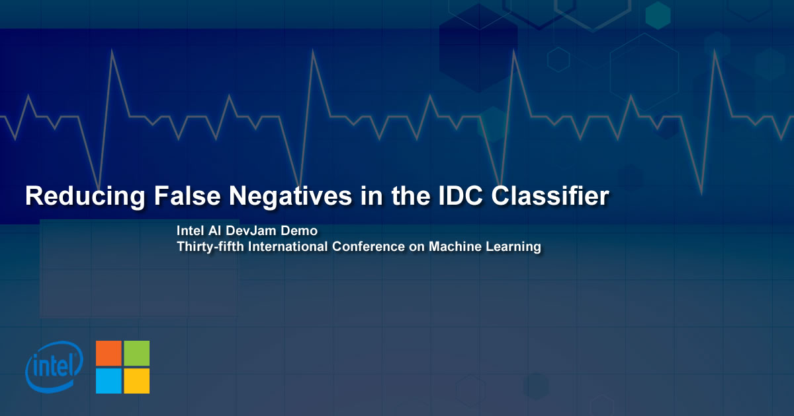
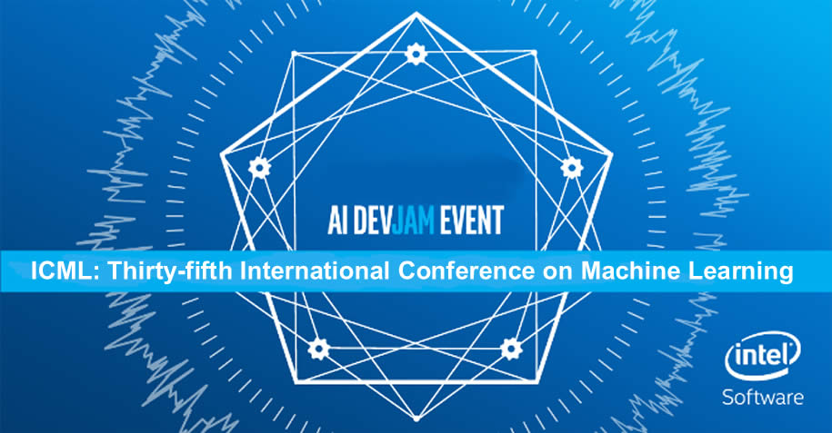

# Reducing False Negatives in the IDC Classifier

## Abstract

The **Intel AI DevJam Demo** project, **Reducing False Negatives in the IDC Classifier**, provides the source codes and tutorials for setting up the project that will be demonstrated at **Intel AI DevJam** at **ICML** (**International Conference on Machine Learning**) in **Sweden**, July 2018.

The **Intel® AI DevJam Demo GUI** uses a **Windows application** to communicate with a **facial recognition classifier** and an option of two classifiers trained to detect **Invasive Ductal Carcinoma (Breast cancer)** in **histology images**. The project combines the  [Invasive Ductal Carcinoma (IDC) Classification Using Computer Vision & IoT](https://github.com/iotJumpway/IoT-JumpWay-Intel-Examples/tree/master/Intel-Movidius/IDC-Classification "Invasive Ductal Carcinoma (IDC) Classification Using Computer Vision & IoT") and [TASS Movidius Facenet Classifier](https://github.com/iotJumpway/IoT-JumpWay-Intel-Examples/tree/master/Intel-Movidius/TASS/Facenet "TASS Movidius Facenet Classifier") projects, along with some new improvements.

The goal of this project is to intentionally try to trick the model by using very similar, but opposite class, images from a small set of testing data that I believe humans may have difficulty telling apart. A larger set of testing data is provided to compare how the model works on larger datasets. 

if we find **false positives** we will attempt to find a way to reduce them, providing a safety net for incorrect classifications that could mean the difference between life and death.

## Jump To Tutorials & Source Codes

- [IDC & Facial Classifiers](https://github.com/iotJumpway/IoT-JumpWay-Microsoft-Examples/tree/master/Intel-AI-DevJam-IDC/IDC-Classifier "IDC & Facial Classifiers") Tutorial & Source Code

- [Universal Windows Application](https://github.com/iotJumpway/IoT-JumpWay-Microsoft-Examples/tree/master/Intel-AI-DevJam-IDC/IDC-Classifier-GUI "Universal Windows Application") Tutorial & Source Code

- [IoT Device](https://github.com/iotJumpway/IoT-JumpWay-Microsoft-Examples/tree/master/Intel-AI-DevJam-IDC/Dev-Kit-IoT-Alarm "IoT Device") Tutorial & Source Code

## About The Project

The **Intel AI DevJam Demo** uses a **Windows application** to communicate with a **facial recognition classifier** and a classifier trained to detect **Invasive Ductal Carcinoma (Breast cancer)** in **histology images**. The project combines the  [Invasive Ductal Carcinoma (IDC) Classification Using Computer Vision & IoT](https://github.com/iotJumpway/IoT-JumpWay-Intel-Examples/tree/master/Intel-Movidius/IDC-Classification "Invasive Ductal Carcinoma (IDC) Classification Using Computer Vision & IoT") and [TASS Movidius Facenet Classifier](https://github.com/iotJumpway/IoT-JumpWay-Intel-Examples/tree/master/Intel-Movidius/TASS/Facenet "TASS Movidius Facenet Classifier") projects.

**Invasive Ductal Carcinoma (IDC) Classification Using Computer Vision & IoT** combines **Computer Vision** and the **Internet of Things** to provide a way to train a neural network with labelled breast cancer histology images to detect **Invasive Ductal Carcinoma (IDC)** in unseen/unlabelled images. There are two models available for the IDC classification, one using a custom trained **Inception V3** model, and one using Cafe.

The **TASS Movidius Facenet Classifier** uses **Siamese Neural Networks** and **Triplet Loss** to classify known and unknown faces.

## IoT Connectivity

**IoT connectivity** for the project is provided by the [IoT JumpWay](https://www.iotjumpway.tech "IoT JumpWay"). The **IoT JumpWay** is an **IoT communication** platform as a service (PaaS) with a social network frontend. IoT JumpWay developers will soon be able to share projects/photos/videos and events. Use of the IoT JumpWay is completely free, you can find out more on the [Developer Program](https://iot.techbubbletechnologies.com/developers/ "Developer Program") page.

## Universal Windows Application

A **Universal Windows Application** allows training and querying the **IDC and facial recognition classifiers**, facial recognition training requires 1 image per person to be able to identify them. The **Windows Universal Application** also allows uploading **histology images** of **IDC** positive or negative slides for classification.

## Intel® Movidius & UP2

For classification the project uses the **Intel® Movidius** and a custom trained **Facenet** to carry out **facial classification**, and a custom trained **Inception V3 model** for detecting **Invasive Ductal Carcinoma (IDC)** homed on an **UP2**. 

The **TASS Movidius Facenet Classifier** uses **Siamese Neural Networks** and **Triplet Loss** to classify known and unknown faces.

## Raspberry Pi 3b

An IoT connected alarm awaits messages for the results of the **facial** and **IDC** classification. In the event an unauthorized user is detected or IDC is detected an alarm (buzzer) is triggered and a red LED lights up, if both classifications are ok a blue LED lights up.

## Bugs/Issues

Please feel free to create issues for bugs and general issues you come across whilst using this or any other IoT JumpWay Microsoft repo issues: [IoT-JumpWay-Microsoft-Examples Github Issues](https://github.com/iotJumpway/IoT-JumpWay-Microsoft-Examples/issues "IoT-JumpWay-Microsoft-Examples Github Issues")

## Contributors

