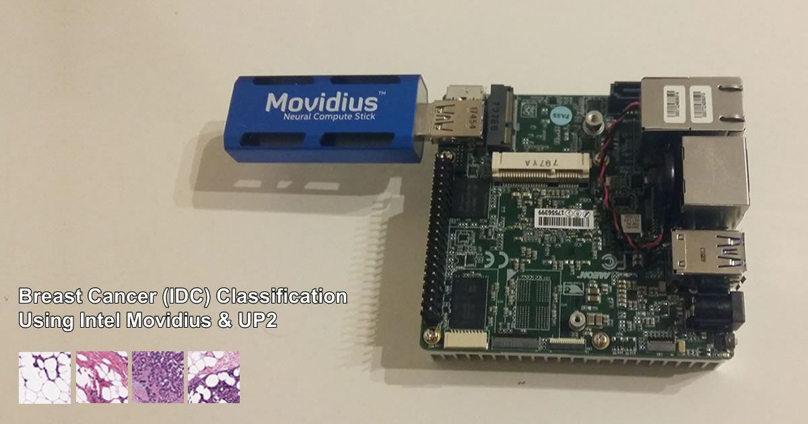

# Invasive Ductal Carcinoma (IDC) Classifier

## Abstract

This project shows how existing deep learning technologies can be utilized to train artificial intelligence (AI) to be able to detect invasive ductal carcinoma (IDC)1 (breast cancer) in unlabeled histology images. More specifically, I show how to train a convolutional neural network using TensorFlow* and transfer learning using a dataset of negative and positive histology images. In addition to showing how artificial intelligence can be used to detect IDC, I also show how the Internet of Things (IoT) can be used in conjunction with AI to create automated systems that can be used in the medical industry.

- [View the technical article on Intel® AI Academy Documentation section of IDZ](https://software.intel.com/en-us/articles/machine-learning-and-mammography "View the technical article on Intel® AI Academy Documentation section of IDZ")

## Projects

The IDC Classifier is made up of 3 projects that combine together to make a network:

- [IDC Classifier: Train a convolutional neural network to be able to detect positive and negative IDC](https://github.com/iotJumpway/IoT-JumpWay-Intel-Examples/tree/master/Intel-Movidius/IDC-Classification/IDC-Classifier "IDC Classifier: Train a covolutional neural network to be able to detect positive and negative IDC")

- [IDC Classifier GUI: Upload testing data and run the IDC Classifier from a Universals Windows Application](https://github.com/iotJumpway/IoT-JumpWay-Intel-Examples/tree/master/Intel-Movidius/IDC-Classification/IDC-Classifier-GUI "IDC Classifier GUI: Upload testing data and run the IDC Classifier from a Universals Windows Application")

## Bugs/Issues

Please feel free to create issues for bugs and general issues you come across whilst using this or any other IoT JumpWay Intel repo issues: [IoT-JumpWay-Intel-Examples Github Issues](https://github.com/iotJumpway/IoT-JumpWay-Intel-Examples/issues "IoT-JumpWay-Intel-Examples Github Issues"). 

## Contributors

