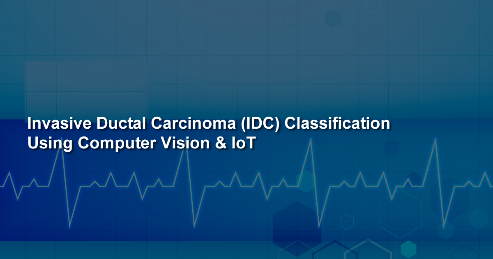
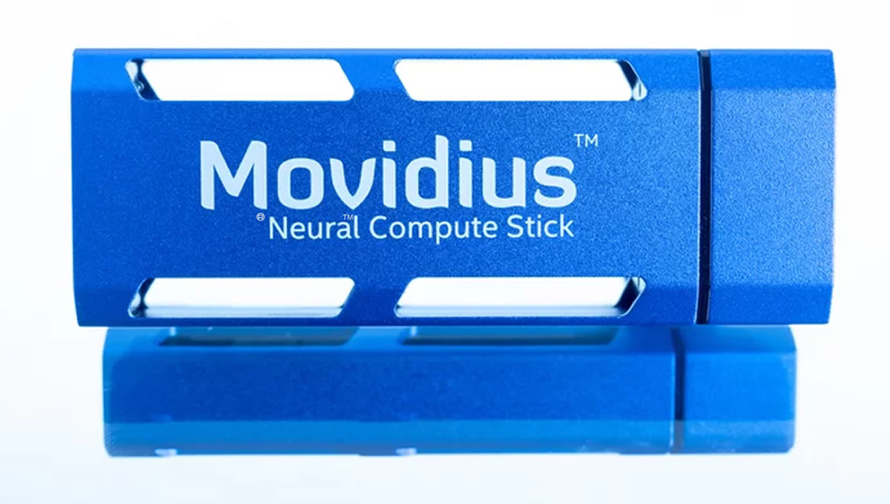

# Invasive Ductal Carcinoma (IDC) Classification Using Computer Vision & IoT



## Introduction

**Invasive Ductal Carcinoma (IDC) Classification Using Computer Vision & IoT** combines **Computer Vision** and the **Internet of Things** to provide researchers, doctors and students with a way to train a neural network with labelled breast cancer histology images to detect Invasive Ductal Carcinoma (IDC) in unseen/unlabelled images.

The project uses the power of the **Intel® Movidius** and uses a custom trained **Inception V3 model** to carry out **image classification**, both locally and via a server / client. IoT communication is powered by the [IoT JumpWay](https://iot.techbubbletechnologies.com "IoT JumpWay") and publishes the results after processing local images or images sent through the API.

## DISCLAIMER

This is a project I created as an extension to one of my facial recognition projects, I advise that this is to be used by developers interested in learning about the use cases of computer vision, medical researchers and students, or professionals in the medical industry to evaluate if it may help them and to expand upon. This is not meant to be an alternative for use instead of seeking professional help. I am a developer not a doctor or expert on cancer.

- **Acknowledgement:** Uses code from Intel® **movidius/ncsdk** ([movidius/ncsdk Github](https://github.com/movidius/ncsdk "movidius/ncsdk Github"))
- **Acknowledgement:** Uses code from chesterkuo **imageclassify-movidius** ([imageclassify-movidius Github](https://github.com/chesterkuo/imageclassify-movidius "imageclassify-movidius Github"))



## What Will We Do?

1.  Install the [Intel® NCSDK](https://github.com/movidius/ncsdk "Intel® NCSDK") on a Linux development device.
2.  Install the [Intel® NCSDK API](https://github.com/movidius/ncsdk "Intel® NCSDK API") on a Raspberry Pi 3 / UP Squared.
3.  Install the [IoT JumpWay Python MQTT Client](https://github.com/AdamMiltonBarker/JumpWayMQTT "IoT JumpWay Python MQTT Client") on the Raspberry Pi / UP Squared and configure the IoT JumpWay.
4.  Clone & Set Up The Repo.
5.  Prepare your training dataset.
6.  Finetuning your training parameters.
7.  Train Inception V3 IDC Classification model on Intel® AI DevCloud.
8.  Train Inception V3 IDC Classification model on a local machine (CPU or GPU).
9.  Convert the model to a format suitable for the Movidius.
10.  Test the IDC classifier locally on the Linux development device.
11. Live IDC classification via the server / client.
12. Build an IoT connected alarm that will be triggered when IDC is detected.

## Applications

**Invasive Ductal Carcinoma (IDC) Classification Using Computer Vision & IoT** is made up of 7 core applications:

- **Trainer:** A training program that allows you to train a convolutional neural network using a local Linux machine.
- **DevCloudTrainer:** A training program that allows you to train a convolutional neural network using Intel® AI DevCloud.
- **Evaluator:** An evaluation program for evaluating your model.
- **Classifier:** A classification program for testing your model.
- **Server/API:** A server that powers a REST Api, providing access to the classifier.
- **Client:** A client that can interact with the server/API.
- **IoT Connected Alarm:** An IoT connected alarm that is triggered when IDC is detected.

## Python Versions

- Tested in Python 3.5

## Software Requirements

- [Intel® NCSDK](https://github.com/movidius/ncsdk "Intel® NCSDK")
- [Tensorflow](https://www.tensorflow.org/install "Tensorflow")
- [IoT JumpWay Python MQTT Client](https://github.com/iotJumpway/JumpWayMQTT "IoT JumpWay Python MQTT Client")
- [GrovePi](https://github.com/DexterInd/GrovePi "GrovePi")

## Hardware Requirements

- 1 x [Intel® Movidius](https://www.movidius.com/ "Intel® Movidius")
- 1 x Linux Device for training & converting the trained model to a Movidius friendly model.
- 1 x Raspberry Pi 3 / UP Squared for the classifier / server.
- 1 x Raspberry Pi 3 for IoT connected alarm.
- 1 x Grove starter kit for IoT, Raspberry Pi edition.
- 1 x Blue LED (Grove)
- 1 x Red LED (Grove)
- 1 x Buzzer (Grove)

## Install NCSDK On Your Development Device

The first thing you will need to do is to install the **NCSDK** on your development device, this will be used to convert the trained model into a format that is compatible with the Movidius.

```
 $ mkdir -p ~/workspace
 $ cd ~/workspace
 $ git clone https://github.com/movidius/ncsdk.git
 $ cd ~/workspace/ncsdk
 $ make install
```

Next plug your Movidius into your device and issue the following commands:

```
 $ cd ~/workspace/ncsdk
 $ make examples
```

## Install NCSDK On Your Raspberry Pi 3 / UP Squared

Next you will need to install the **NCSDK** on your Raspberry Pi 3 / UP Squared device, this will be used by the classifier to carry out inference on local images or images received via the API we will create.

```
 $ mkdir -p ~/workspace
 $ cd ~/workspace
 $ git clone https://github.com/movidius/ncsdk.git
 $ cd ~/workspace/ncsdk/api/src
 $ make
 $ sudo make install
```
```
 $ cd ~/workspace
 $ git clone https://github.com/movidius/ncappzoo
 $ cd ncappzoo/apps/hello_ncs_py
 $ python3 hello_ncs.py
```

## Getting Started With The IoT JumpWay

There are a few tutorials that you should follow before beginning, especially if it is the first time you have used the **IoT JumpWay Developer Program**. If you do not already have one, you will require an **IoT JumpWay Developer Program developer account**, and some basics to be set up before you can start creating your IoT devices. Visit the following [IoT JumpWay Developer Program Docs (5-10 minute read/setup)](https://github.com/iotJumpWay/IoT-JumpWay-Docs/ "IoT JumpWay Developer Program Docs (5-10 minute read/setup)") and check out the guides that take you through registration and setting up your Location Space, Zones, Devices and Applications (About 5 minutes read).

## Install IoT JumpWay Python MQTT Client On Your Raspberry Pi 3 / UP Squared

Next install the IoT JumpWay Python MQTT Client on your Raspberry Pi 3 / UP Squared. For this you can execute the following command:

```
 $ pip3 install JumpWayMQTT
```

## IoT JumpWay Device Connection Credentials & Settings

- Setup an IoT JumpWay Location Device for IDC Classifier, ensuring you set up a camera node, as you will need the ID of the dummy camera for the project to work. Once your create your device add the location ID and Zone ID to the **IoTJumpWay** details in the confs file located at **model/confs.json**, also add the device ID and device name exactly, add the MQTT credentials to the **IoTJumpWayMQTT** .

You will need to edit your device and add the rules that will allow it to communicate autonomously with the other devices and applications on the network, but for now, these are the only steps that need doing at this point.

Follow the [IoT JumpWay Developer Program (BETA) Location Device Doc](https://github.com/iotJumpWay/IoT-JumpWay-Docs/blob/master/4-Location-Devices.md "IoT JumpWay Developer Program (BETA) Location Device Doc") to set up your devices.

```
{
    "IoTJumpWay": {
        "Location": 0,
        "Zone": 0,
        "Device": 0,
        "DeviceName" : "",
        "App": 0,
        "AppName": ""
    },
    "Actuators": {},
    "Cameras": [
        {
            "ID": 0,
            "URL": 0,
            "Name": ""
        }
    ],
    "Sensors": {},
	"IoTJumpWayMQTT": {
        "MQTTUsername": "",
        "MQTTPassword": ""
    },
    "ClassifierSettings":{
        "dataset_dir":"model/train/",
        "log_dir":"model/_logs",
        "log_eval":"model/_logs_eval",
        "classes":"model/classes.txt",
        "labels":"labels.txt",
        "labels_file":"model/train/labels.txt",
        "validation_size":0.3,
        "num_shards":2,
        "random_seed":50,
        "tfrecord_filename":"200label",
        "file_pattern":"200label_%s_*.tfrecord",
        "image_size":299,
        "num_classes":2,
        "num_epochs":60,
        "dev_cloud_epochs":20,
        "test_num_epochs":1,
        "batch_size":10,
        "test_batch_size":36,
        "initial_learning_rate":0.0001,
        "learning_rate_decay_factor":0.96,
        "num_epochs_before_decay":10,
        "NetworkPath":"",
        "InceptionImagePath":"model/test/",
        "InceptionThreshold": 0.54,
        "InceptionGraph":"igraph"
    }
}
```

## Cloning The Repo

You will need to clone this repository to a location on your development terminal. Navigate to the directory you would like to download it to and issue the following commands.

    $ git clone https://github.com/iotJumpway/IoT-JumpWay-Intel-Examples.git

Once you have the repo, you will need to find the files in this folder located in [IoT-JumpWay-Intel-Examples/master/Intel-Movidius/IDC-Classification](https://github.com/iotJumpway/IoT-JumpWay-Intel-Examples/tree/master/Intel-Movidius/IDC-Classification "IoT-JumpWay-Intel-Examples/master/Intel-Movidius/IDC-Classification").

## Preparing Your IDC Training Data

For this tutorial, I used a dataset from Kaggle ( [Predict IDC in Breast Cancer Histology Images](https://www.kaggle.com/paultimothymooney/predict-idc-in-breast-cancer-histology-image "Predict IDC in Breast Cancer Histology Images") ), but you are free to use any dataset you like. I have uploaded the collection I used for positive and negative images which you will find in the **model/train** directory. Once you decide on your dataset you need to arrange your data into the **model/train** directory. Each subdirectory should be entitled with integers, I used 0 and 1 to represent positive and negative. In my testing I used 4400 positive and 4400 negative examples giving an overall training accuracy of 0.8716 and an average confidence of 0.96 on correct identifications. The data provided is 50px x 50px, as Inception V3 was trained on images of size 299px x 299px, the images are resized to 299px x 299px, ideally the images would be that size already so you may want to try different datasets and see how your results vary.

**If you are training your model on the Intel® AI DevCloud you need to reduce your dataset to 1000 images per class before uploading the dataset.**

## Finetuning Your Training Parameters

You can finetune the settings of the network at any time by editing the classifier settings in the **model/confs.json** file.

```
"ClassifierSettings":{
    "dataset_dir":"model/train/",
    "log_dir":"model/_logs",
    "log_eval":"model/_logs_eval",
    "classes":"model/classes.txt",
    "labels":"labels.txt",
    "labels_file":"model/train/labels.txt",
    "validation_size":0.3,
    "num_shards":2,
    "random_seed":50,
    "tfrecord_filename":"200label",
    "file_pattern":"200label_%s_*.tfrecord",
    "image_size":299,
    "num_classes":2,
    "num_epochs":60,
    "dev_cloud_epochs":20,
    "test_num_epochs":1,
    "batch_size":10,
    "test_batch_size":36,
    "initial_learning_rate":0.0001,
    "learning_rate_decay_factor":0.96,
    "num_epochs_before_decay":10,
    "NetworkPath":"",
    "InceptionImagePath":"model/test/",
    "InceptionThreshold": 0.54,
    "InceptionGraph":"igraph"
}
```

## Training Your IDC Model On Intel® AI DevCloud

Ensure that you have reduced the dataset to 1000 images per class then upload the files and folders outlined below to AI DevCloud.

```
model
tools
DevCloudTrainer.ipynb
DevCloudTrainer.py
Eval.py
```

Once uploaded follow the instructions in **DevCloudTrainer.ipynb**, when the training completes you need to download **model/DevCloudIDC.pb** and **model/classes.txt** to the **model** directory on your development machine, ensure the Movidius is setup and connected and then run the following commands on your development machine:

```
$ cd ~/IoT-JumpWay-Intel-Examples/master/Intel-Movidius/IDC-Classification
$ ./DevCloudTrainer.sh
```

The contents of DevCloudTrainer.sh are as follows:

```
#IDC Classification Trainer
mvNCCompile model/DevCloudIDC.pb -in=input -on=InceptionV3/Predictions/Softmax
mv graph igraph
python3.5 Classifier.py InceptionTest
```

1. Compile the model for Movidius
2. Rename the graph file
3. Test

## Training Your IDC Model On A Local Device (CPU or GPU)

Once you have prepared your training data and have Tensorflow & NCSDK installed on your device, you are ready to start training. For training I suggest using an NVIDIA GPU, if you do use a GPU make sure you install Tensorflow GPU and not Tensorflow CPU. To begin training, you simply need to issue the following commands:

```
$ cd ~/IoT-JumpWay-Intel-Examples/master/Intel-Movidius/IDC-Classification
$ ./Trainer.sh
```

The contents of Trainer.sh are as follows:

```
#TASS Movidius Trainer
pip3 install -r requirements.txt
python3.5 Trainer.py DataSort
python3.5 Trainer.py Train
mvNCCompile model/MovidiusInception.pb -in=input -on=InceptionV3/Predictions/Softmax
mv graph igraph
python3.5 Eval.py
python3.5 Classifier.py InceptionTest
```

1. Install any requirements
2. Sort our training data
3. Train the model
4. Compile the model for Movidius
5. Rename the graph file
6. Evaluate
7. Test

## Evaluating & Testing Your Model On A Local Device (CPU or GPU)

If you are training on a development device, once training has finished and the Movidius compatible graph has been generated, the shell script will execute the evaluation program and start the classifier in test mode.  If you are training on AI DevCloud the evaluation part is included in the notebook. The output of the program will be shown in your terminal. After just a few hours training, the model was performing very well with a final streaming accuracy of 0.9060.

```
INFO:tensorflow:Restoring parameters from model/_logs_eval/model.ckpt-2
INFO:tensorflow:Starting standard services.
INFO:tensorflow:Saving checkpoint to path model/_logs_eval/model.ckpt
INFO:tensorflow:Starting queue runners.
INFO:tensorflow:global_step/sec: 0
INFO:tensorflow:Epoch: 1.0/1
INFO:tensorflow:Current Streaming Accuracy: 0.0000
INFO:tensorflow:Global Step 4: Streaming Accuracy: 0.0000 (4.15 sec/step)
INFO:tensorflow:Global Step 5: Streaming Accuracy: 0.8611 (0.86 sec/step)
INFO:tensorflow:Global Step 6: Streaming Accuracy: 0.8611 (0.87 sec/step)
INFO:tensorflow:Global Step 7: Streaming Accuracy: 0.8796 (0.94 sec/step)
INFO:tensorflow:Global Step 8: Streaming Accuracy: 0.8889 (1.00 sec/step)
INFO:tensorflow:Global Step 9: Streaming Accuracy: 0.8778 (0.99 sec/step)
INFO:tensorflow:Global Step 10: Streaming Accuracy: 0.8704 (1.00 sec/step)

---------------------------------------------------------------------------

INFO:tensorflow:Global Step 66: Streaming Accuracy: 0.9059 (0.99 sec/step)
INFO:tensorflow:Global Step 67: Streaming Accuracy: 0.9061 (0.99 sec/step)
INFO:tensorflow:Global Step 68: Streaming Accuracy: 0.9058 (1.00 sec/step)
INFO:tensorflow:Global Step 69: Streaming Accuracy: 0.9043 (1.01 sec/step)
INFO:tensorflow:Global Step 70: Streaming Accuracy: 0.9045 (0.98 sec/step)
INFO:tensorflow:Global Step 71: Streaming Accuracy: 0.9046 (0.99 sec/step)
INFO:tensorflow:Global Step 72: Streaming Accuracy: 0.9048 (0.99 sec/step)
INFO:tensorflow:Global Step 73: Streaming Accuracy: 0.9058 (0.98 sec/step)
INFO:tensorflow:Global Step 74: Streaming Accuracy: 0.9067 (0.99 sec/step)
INFO:tensorflow:Global Step 75: Streaming Accuracy: 0.9065 (1.00 sec/step)
INFO:tensorflow:Global Step 76: Streaming Accuracy: 0.9062 (0.99 sec/step)
INFO:tensorflow:Final Streaming Accuracy: 0.9060
```

## Testing Your IDC Model On A Local Device (CPU or GPU)

If you are training on a development device, once evaluation has finished the testing program will start. In my example I had two classes 0 and 1 (IDC negative & IDC positive), a classification of 0 shows that the AI thinks the image is not IDC positive, and a classification of 1 is positive.

```
-- Loaded Test Image model/test/8980_idx5_x751_y1051_class1.png

-- DETECTION STARTING
-- STARTED: :  2018-03-06 15:40:00.464726


-- DETECTION ENDING
-- ENDED:  2018-03-06 15:40:02.386694
-- TIME: 1.9219634532928467

TASS Identified IDC with A Confidence Of 0.9707

-- Published to Device Sensors Channel

*******************************************************************************
inception-v3 on NCS
*******************************************************************************
1 1 0.9707
0 0 0.02898
*******************************************************************************

-- Published: 2
-- Loaded Test Image model/test/8980_idx5_x101_y1051_class0.png

-- DETECTION STARTING
-- STARTED: :  2018-03-06 15:40:02.390235


-- DETECTION ENDING
-- ENDED:  2018-03-06 15:40:04.281153
-- TIME: 1.8909223079681396

*******************************************************************************
inception-v3 on NCS
*******************************************************************************
0 0 0.9873
1 1 0.01263
*******************************************************************************
```

## Serving Your Live IDC Model

Now that we are all trained and tested, it is time to set up the server that will serve the API. For this I have provided **Server.py** and **Client.py**

The following instructions will help you set up your server and test a positive and negative prediction:

1. If you used the [Predict IDC in Breast Cancer Histology Images](https://www.kaggle.com/paultimothymooney/predict-idc-in-breast-cancer-histology-image "Predict IDC in Breast Cancer Histology Images") dataset, you can use the **positive.png** & **negative.png** as they are from that dataset, if not you should chose a positive and negative example from your testing set and replace these images.

2. The server is currently set to start up on localhost, if you would like to change this you need to edit line 281 of **Server.py** and line 38 of **Client.py** to match your desired host. Once you have things working, if you are going to be leaving this running and access it from the outside world you shoud secure it with LetsEncrypt or similar.

3. Upload the following files and folders to the UP Squared or Raspberry Pi 3 that you are going to use for the server.

```
model/test/
model/classes.txt
model/confs.json
tools
igraph
Server.py
```

4. Open up a terminal and navigate to the to the folder containing Server.py then issue the following command. This will start the server and wait to receive images for classification.

```
$ python3.5 Server.py
```

5. If you have followed all of the above steps, you can now start the client on your development machine with the following commands:

```
$ python3.5 Client.py
```

This will send a positive and negative histology slide to the Raspberry Pi 3 / UP Squared which will return the predictions.

```
!! Welcome to IDC Classification, please wait while the program initiates !!

-- Running on Python 3.5.2 (default, Nov 23 2017, 16:37:01)
[GCC 5.4.0 20160609]

-- Imported Required Modules
-- TassMovidiusClient Initiated

{'Response': 'OK', 'ResponseMessage': 'IDC Detected!', 'Results': 1}
{'Response': 'OK', 'ResponseMessage': 'IDC Not Detected!', 'Results': 0}

```

```
-- INCEPTION V3 LIVE INFERENCE STARTING
-- STARTED: :  2018-03-06 17:10:38.826920

Server.py:148: DeprecationWarning: The binary mode of fromstring is deprecated, as it behaves surprisingly on unicode inputs. Use frombuffer instead
  nparr = np.fromstring(r.data, np.uint8)
-- Loading Sample
-- Loaded Sample
-- DETECTION STARTING
-- STARTED: :  2018-03-06 17:10:38.830703


-- DETECTION ENDING
-- ENDED:  2018-03-06 17:10:40.751271
-- TIME: 1.9205756187438965


TASS Identified IDC with a confidence of 0.816

-- Published to Device Sensors Channel

*******************************************************************************
-- Published: 2
inception-v3 on NCS
*******************************************************************************
1 1 0.816
0 0 0.1838
*******************************************************************************

-- INCEPTION V3 LIVE INFERENCE ENDING
-- ENDED:  2018-03-06 17:10:40.752129
-- TESTED:  1
-- IDENTIFIED:  1
-- TIME(secs): 1.9252095222473145
```

```
-- INCEPTION V3 LIVE INFERENCE STARTING
-- STARTED: :  2018-03-06 17:10:45.777470

-- Loading Sample
-- Loaded Sample
-- DETECTION STARTING
-- STARTED: :  2018-03-06 17:10:45.781196


-- DETECTION ENDING
-- ENDED:  2018-03-06 17:10:47.671904
-- TIME: 1.8907184600830078

*******************************************************************************
inception-v3 on NCS
*******************************************************************************
0 0 0.994
1 1 0.00566
*******************************************************************************

-- INCEPTION V3 LIVE INFERENCE ENDING
-- ENDED:  2018-03-06 17:10:47.672187
-- TESTED:  1
-- IDENTIFIED:  0
-- TIME(secs): 1.8947057723999023
```

## Bugs/Issues

Please feel free to create issues for bugs and general issues you come across whilst using this or any other Intel® related IoT JumpWay issues. You may also use the issues area to ask for general help whilst using the IoT JumpWay in your IoT projects.

## Contributors

[](https://github.com/AdamMiltonBarker)

