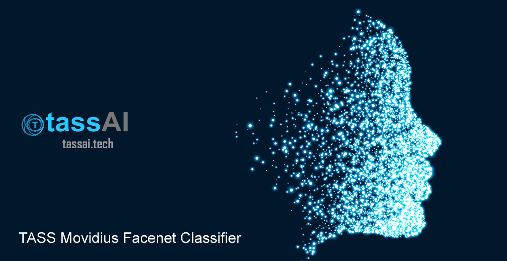
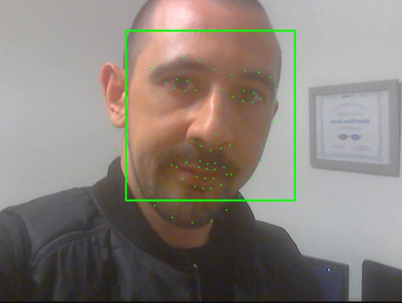

# TASS Movidius Facenet Classifier

[](https://github.com/iotJumpway/IoT-JumpWay-Intel-Examples/tree/master/Intel-Movidius/TASS/Facenet)

The **TASS Movidius Facenet Classifier** uses Siamese Neural Networks and Triplet Loss to classify known and unknown faces. The project uses an UP2 the Intel Movidius and the [IoT JumpWay](https://iot.techbubbletechnologies.com "IoT JumpWay") for IoT connectivity.

- **Acknowledgement:** Uses code from Intel® **movidius/ncsdk** ([movidius/ncsdk Github](https://github.com/movidius/ncsdk "movidius/ncsdk Github"))
- **Acknowledgement:** Uses code from Intel® **davidsandberg/facenet** ([davidsandberg/facenet Github](https://github.com/davidsandberg/facenet "davidsandberg/facenet"))

## What Will We Do?

1. Install the [Intel® NCSDK](https://github.com/movidius/ncsdk "Intel® NCSDK") on a Linux development device.
2. Install the [Intel® NCSDK API](https://github.com/movidius/ncsdk "Intel® NCSDK API") on a Raspberry Pi 3 / UP Squared.
3. Install the [IoT JumpWay Python MQTT Client](https://github.com/AdamMiltonBarker/JumpWayMQTT "IoT JumpWay Python MQTT Client") on the Raspberry Pi / UP Squared and configure the IoT JumpWay.
4. Clone & set up the repo.
5. Install and download all requirements.
6. Prepare your known and testing faces datasets.
7. Test the **TASS Movidius Facenet Classifier** on the testing dataset.
8. Run **TASS Movidius Facenet Classifier** on a live webcam
9. Build an IoT connected alarm that will be triggered when an unknown person is detected.

## Applications

**TASS Movidius Facenet Classifier** is made up of 4 core applications/programs:

- **Setup:** setup.sh is a program designed to set up all required software for the classifier to function and to download the pretrained models.
- **Classifier:** A classification program for testing known and unknown people using the **testing** and **valid** datasets.
- **Webcam Classifier:** A clssification program that connects to a local webcam.
- **IoT Connected Alarm:** An IoT connected alarm that is triggered when an unknown person is detected.

## Python Versions

- Tested in Python 3.5

## Software Requirements

- [Intel® NCSDK](https://github.com/movidius/ncsdk "Intel® NCSDK")
- [Tensorflow 1.4.0](https://www.tensorflow.org/install "Tensorflow 1.4.0")
- [IoT JumpWay Python MQTT Client](https://github.com/iotJumpway/JumpWayMQTT "IoT JumpWay Python MQTT Client")
- [GrovePi](https://github.com/DexterInd/GrovePi "GrovePi")

## Hardware Requirements

- 1 x [Intel® Movidius](https://www.movidius.com/ "Intel® Movidius")
- 1 x Linux Device for converting the pretrained model to a Movidius friendly model.
- 1 x Raspberry Pi 3 / UP Squared for the classifier / webcam.
- 1 x Raspberry Pi 3 for IoT connected alarm.
- 1 x Grove starter kit for IoT, Raspberry Pi edition.
- 1 x Blue LED (Grove)
- 1 x Red LED (Grove)
- 1 x Buzzer (Grove)

## Install NCSDK On Your Development Device

The first thing you will need to do is to install the **NCSDK** on your development device, this will be used to convert the trained model into a format that is compatible with the Movidius.

```
 $ mkdir -p ~/workspace
 $ cd ~/workspace
 $ git clone https://github.com/movidius/ncsdk.git
 $ cd ~/workspace/ncsdk
 $ make install
```

Next plug your Movidius into your device and issue the following commands:

```
 $ cd ~/workspace/ncsdk
 $ make examples
```

## Install NCSDK On Your Raspberry Pi 3 / UP Squared


Next you will need to install the **NCSDK** on your Raspberry Pi 3 / UP Squared device, this will be used by the classifier to carry out inference on local images or frames from the webcam. Make sure you have the Movidius plugged in.

```
 $ mkdir -p ~/workspace
 $ cd ~/workspace
 $ git clone https://github.com/movidius/ncsdk.git
 $ cd ~/workspace/ncsdk/api/src
 $ make
 $ sudo make install
```
```
 $ cd ~/workspace
 $ git clone https://github.com/movidius/ncappzoo
 $ cd ncappzoo/apps/hello_ncs_py
 $ python3 hello_ncs.py
```

## Getting Started With The IoT JumpWay

There are a few tutorials that you should follow before beginning, especially if it is the first time you have used the **IoT JumpWay Developer Program**. If you do not already have one, you will require an **IoT JumpWay Developer Program developer account**, and some basics to be set up before you can start creating your IoT devices. Visit the following [IoT JumpWay Developer Program Docs (5-10 minute read/setup)](https://github.com/iotJumpWay/IoT-JumpWay-Docs/ "IoT JumpWay Developer Program Docs (5-10 minute read/setup)") and check out the guides that take you through registration and setting up your Location Space, Zones, Devices and Applications (About 5 minutes read).

## Install IoT JumpWay Python MQTT Client On Your Raspberry Pi 3 / UP Squared

Next install the IoT JumpWay Python MQTT Client on your Raspberry Pi 3 / UP Squared. For this you can execute the following command:

```
 $ pip3 install JumpWayMQTT
```

## IoT JumpWay Device Connection Credentials & Settings

- Setup an IoT JumpWay Location Device for IDC Classifier, ensuring you set up a camera node, as you will need the ID of the dummy camera for the project to work. Once your create your device add the location ID and Zone ID to the **IoTJumpWay** details in the confs file located at **required/confs.json**, also add the device ID and device name exactly, add the MQTT credentials to the **IoTJumpWayMQTT** .

You will need to edit your device and add the rules that will allow it to communicate autonomously with the other devices and applications on the network, but for now, these are the only steps that need doing at this point.

Follow the [IoT JumpWay Developer Program (BETA) Location Device Doc](https://github.com/iotJumpWay/IoT-JumpWay-Docs/blob/master/4-Location-Devices.md "IoT JumpWay Developer Program (BETA) Location Device Doc") to set up your devices.

```
{
    "IoTJumpWay": {
        "Location": 0,
        "Zone": 0,
        "Device": 0,
        "DeviceName" : "",
        "App": 0,
        "AppName": ""
    },
    "Actuators": {},
    "Cameras": [
        {
            "ID": 0,
            "URL": 0,
            "Name": "",
            "Stream": "",
            "StreamPort": 8080
        }
    ],
    "Sensors": {},
	"IoTJumpWayMQTT": {
        "MQTTUsername": "",
        "MQTTPassword": ""
    },
    "ClassifierSettings":{
        "NetworkPath":"",
        "Graph":"model/tass.graph",
        "Dlib":"model/dlib/shape_predictor_68_face_landmarks.dat",
        "dataset_dir":"model/train/",
        "TestingPath":"data/testing/",
        "ValidPath":"data/known/",
        "Threshold": 1.20
    }
}
```

## Cloning The Repo

You will need to clone this repository to a location on your development terminal. Navigate to the directory you would like to download it to and issue the following commands.

    $ git clone https://github.com/iotJumpway/IoT-JumpWay-Intel-Examples.git

Once you have the repo, you will need to find the files in this folder located in [IoT-JumpWay-Intel-Examples/Intel-Movidius/TASS/Facenet](https://github.com/iotJumpway/IoT-JumpWay-Intel-Examples/tree/master/Intel-Movidius/TASS/Facenet "IoT-JumpWay-Intel-Examples/Intel-Movidius/TASS/Facenet").

## Setup

Now you need to setup the software required for the classifier to run. The setup.sh script is a shell script that you can run on both your development device and Raspberry Pi 3 / UP Squared device. 

- Install the required packages named in **requirements.txt**
- Downloads the pretrained Facenet model (**davidsandberg/facenet**)
- Downloads the pretrained **Inception V3** model
- Converts the **Facenet** model to a model that is compatible with the **Intel® Movidius**

Make sure you have installed the **NCSDK** on your developement machine and then run the following command, assuming you are located in the [IoT-JumpWay-Intel-Examples/Intel-Movidius/TASS/Facenet](https://github.com/iotJumpway/IoT-JumpWay-Intel-Examples/tree/master/Intel-Movidius/TASS/Facenet "IoT-JumpWay-Intel-Examples/Intel-Movidius/TASS/Facenet") directory.

```
 $ sh setup.sh
```

If you have problems running the above program and have errors try run the following command before executing the shell script. You may be getting errors due to the shell script having been edited on Windows, the following command will clean the setup file.

```
 $ sed -i 's/\r//' setup.sh
 $ sh setup.sh
```

## Preparing Your Dataset

You need to set up two very small datasets. As we are using a pretrained Facenet model there is no training to do in this tutorial and we only need one image per known person. You should see the **known** and **testing** folders in the **data** directory, this is where you will store 1 image of each person you want to be identified by the network, and also a testing dataset that can include either known or unknown faces for testing. When you store the known data, you should name each image with the name you want them to be identified as in the system, in my testing I used images of me and two other random people, the 1 image used to represent myself in the known folder was named Adam  

## Test the TASS Movidius Facenet Classifier

Now it is time to test out your classifier, on your development machine in the [IoT-JumpWay-Intel-Examples/Intel-Movidius/TASS/Facenet](https://github.com/iotJumpway/IoT-JumpWay-Intel-Examples/tree/master/Intel-Movidius/TASS/Facenet "IoT-JumpWay-Intel-Examples/Intel-Movidius/TASS/Facenet") directory:

```
 $ python3.5 Classifier.py
```

This will run the classifier test program, the program will first loop through your testing images, and once it sees a face it will loop through all of the known faces and match them against the faces, once it finds a match, or not, it will move on to the next image in your testing loop until all images have been classifier as known or unknown. Below is the output of my testing.

```
!! Welcome to TASS Movidius Facenet Classifier, please wait while the program initiates !!

-- Running on Python 3.5.2 (default, Nov 23 2017, 16:37:01)
[GCC 5.4.0 20160609]

-- Imported Required Modules
-- Movidius Connected
-- Allocated Graph OK
-- Initiating JumpWayMQTT Device
-- JumpWayMQTT Device Initiated
-- JumpWayMQTT Device Connection Initiating
-- JumpWayMQTT Device Connection Initiated
-- IoT JumpWay Initiated

-- Classifier Initiated

-- FACENET TEST MODE STARTING
-- STARTED: :  2018-05-18 15:14:10.957737

-- JumpWayMQTT Device Connected
rc: 0
-- Published to Device Status
-- Published: 1
Total Difference is: 1.1339170932769775
-- MATCH Adam-3.jpg

-- Published to Device Warnings Channel
-- Published: 2
Total Difference is: 1.7931939363479614
-- NO MATCH

-- Published to Device Warnings Channel
-- Published: 3
Total Difference is: 0.8448524475097656
-- MATCH Adam-2.jpg

-- Published to Device Warnings Channel
-- Published: 4
Total Difference is: 0.8118671178817749
-- MATCH Adam-6.jpg

-- Published to Device Warnings Channel
-- Published: 5
Total Difference is: 1.8371777534484863
-- NO MATCH

-- Published: 6
-- Published to Device Warnings Channel
Total Difference is: 0.0
-- MATCH adam.jpg

-- Published: 7
-- Published to Device Warnings Channel
Total Difference is: 0.8795345425605774
-- MATCH Adam-4.jpg

-- Published: 8
-- Published to Device Warnings Channel
Total Difference is: 1.0212488770484924
-- MATCH Adam-5.jpg

-- Published: 9
-- Published to Device Warnings Channel

-- FACENET TEST MODE ENDING
-- ENDED:  2018-05-18 15:14:13.503037
-- TESTED:  8
-- IDENTIFIED:  6
-- TIME(secs): 2.545285224914551

!! SHUTTING DOWN !!
```

You can see that each of my 6 testing images were correctly identified and the unknowns were correctly not matched. Something to note is the the testing images I used of myself were all different, in some I had a beard, in some I have sunglasses &/or a hat, in each case I was identified by the classifier. 

## Run **TASS Movidius Facenet Classifier** on a live webcam

Now comes the good part, realtime facial recognition and identification. 



The WClassifier.py should connect to the local webcam on your device, process the frames and send them to a local server that is started by this same program. Be sure to edit the **ID** and **Name** values of the **Cameras** section of **required/confs.json** section using the details provided when setting up the configs, and add the URL of the IP of your device ie: http://192.168.1.200 to the **Stream** value and you can change **StreamPort** to whatever you want. These two fields will determine the address that you access your camera on, using the previous IP (Stream) and the StreamPort as 8080 the address would be **http://192.168.1.200:8080/index.html**.

```
"Cameras": [
{
    "ID": 0,
    "URL": 0,
    "Name": "",
    "Stream": "",
    "StreamPort": 8080
}
```

The program uses a **dlib** model to recognize faces in the frames / mark the facial points on the frame, and **Facenet** to determine whether they are a known person or not. Below are the outputs around the time that the above photo was taken. You will see that the program publishes to the **Warnings** channel of the IoT JumpWay, this is currently the name for the channel that handles device to device communication via rules.

```
-- Saved frame

Total Difference is: 1.0537698864936829
-- MATCH

-- Published: 30
-- Published to Device Warnings Channel
-- Saved frame

Total Difference is: 0.9751482605934143
-- MATCH

-- Published to Device Warnings Channel
-- Published: 31
-- Saved frame

Total Difference is: 0.8911715745925903
-- MATCH

-- Published to Device Warnings Channel
-- Published: 32
-- Saved frame

Total Difference is: 1.0292763113975525
-- MATCH

-- Published to Device Warnings Channel
-- Published: 33
-- Saved frame

Total Difference is: 0.9804747700691223
-- MATCH

-- Published to Device Warnings Channel
-- Published: 34
-- Saved frame

Total Difference is: 1.0326017141342163
-- MATCH

-- Published to Device Warnings Channel
-- Published: 35
-- Saved frame

Total Difference is: 0.9248141050338745
-- MATCH

-- Published to Device Warnings Channel
-- Published: 36
```
```

## Build an IoT connected alarm


The next step is to set up your Raspberry Pi 3 so that the classifier can communicate with it via the IoT JumpWay. For this, I already created a tutorial for the IoT JumpWay Raspberry Pi Dev Kit IoT Alarm that will guide you through this process. The only difference is that you do not need to set up the Python commands application, as in this project, the classifier will replace the Python commands application, to save time please only follow the steps for Device.py and not Application.py. You will need to uncomment lines 104 - 107 to ensure that the LEDs and buzzer turn off after some time, you can update line 107 to set the amount of time to keep them running for.

You will find the tutorial on the following link: [IoT JumpWay Raspberry Pi Dev Kit IoT Alarm](https://github.com/iotJumpway/IoT-JumpWay-RPI-Examples/tree/master/Dev-Kit-IoT-Alarm/Python "IoT JumpWay Raspberry Pi Dev Kit IoT Alarm")

Once you have completed that tutorial and have your device setup, return here to complete the final integration steps.

## Setting Up Your Rules

You are now ready to take the final steps, at this point you should have everything set up and your Raspberry Pi Dev Kit IoT Alarm should be running and connected to the IoT JumpWay waiting for instructions.

Next we are going to set up the rules that allow the classifier to control your Raspberry Pi Dev Kit IoT Alarm autonomously. Go back to the classifier device edit page. Scroll down to below where you added the camera node and you will see you are able to add rules.


The rules that we want to add are as follows:

1. When an intruder is identified, turn on the red LED.

2. When an intruder is identified, turn on the buzzer.

3. When a known person is identified, turn on the blue LED.

The events are going be triggered by warning messages sent from the IDC classifier / server, so in the **On Event Of** drop down, select **WARNING**. Then you need to select the camera node you added to the IDC device, as this is the sensor that the warning will come from. Next choose **RECOGNISED** in the **With Warning Of**, which will mean that the rule will be triggered when the IoT JumpWay receives a warning message that an intruder has been identified, then select the **Send Device Command** for the **Take The Following Action** section, choose the Raspberry Pi Dev Kit IoT Alarm as the device, the red LED as the sensor/actuator, **TOGGLE** as the action and on as the command. This will then tell the Raspberry Pi  to turn on the red light in the event of an intruder being detected, repeat this process for the buzzer. Finally repeat the LED command for the blue LED but with **NOT RECOGNISED** in the **With Warning Of** and selecting the ID that represents the blue LED you set up on the Raspberry Pi.

## Viewing Your Data

When the program processes an image, it will send sensor & warning data where relevant to the [IoT JumpWay](https://iot.techbubbletechnologies.com/ "IoT JumpWay"). You will be able to access the data in the [IoT JumpWay Developers Area](https://iot.techbubbletechnologies.com/developers/dashboard/ "IoT JumpWay Developers Area"). Once you have logged into the Developers Area, visit the [IoT JumpWay Location Devices Page](https://iot.techbubbletechnologies.com/developers/location-devices "Location Devices page"), find your device and then visit the Sensor Data pages to view the data sent from the device. You can also view command messages for the Raspberry Pi in the Raspberry Pi device page under the Commands tab.


## Bugs/Issues

Please feel free to create issues for bugs and general issues you come across whilst using this or any other Intel® related IoT JumpWay issues. You may also use the issues area to ask for general help whilst using the IoT JumpWay in your IoT projects.

## Contributors

[](https://github.com/AdamMiltonBarker)


