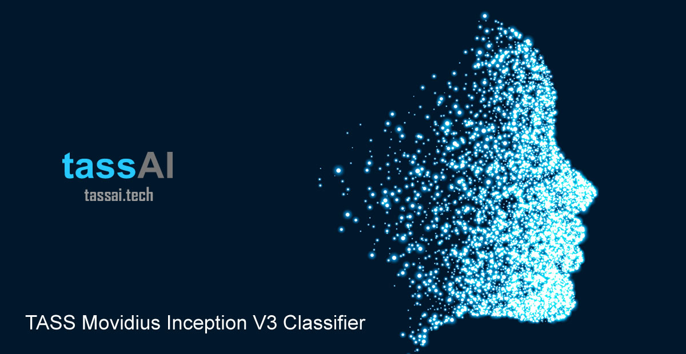
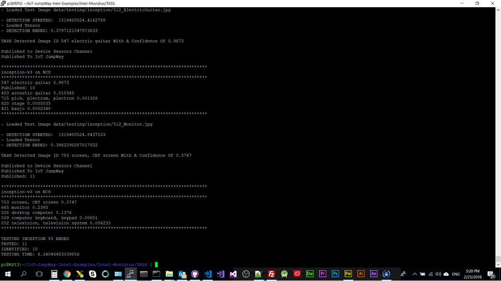
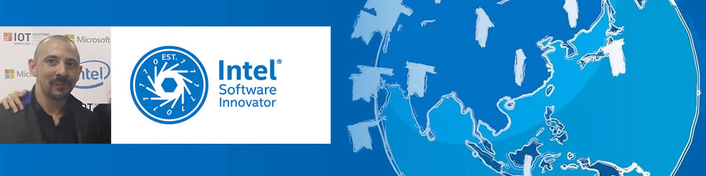

# TASS Movidius Inception V3 Classifier



## Introduction

The **TASS Movidius Inception V3** Classifier uses a pretrained or custom trained **Inception V3** model and an **Intel® Movidius** to carry out object and **facial classification**, both locally and on a live webcam stream. TASS Movidius uses the [IoT JumpWay](https://iot.techbubbletechnologies.com "IoT JumpWay") for IoT communication and publishes messages to the broker when an object is identified.

- **Acknowledgement:** Uses code from Intel® **movidius/ncsdk** ([movidius/ncsdk Github](https://github.com/movidius/ncsdk "movidius/ncsdk Github"))


## IoT Devices:

This tutorial will result in two IoT devices:

1. IoT connected computer vision device using a **Raspberry Pi 3** / **UP Squared** for the classifier / webcam & **Intel® Movidius**.
2. IoT connected alarm system using an **Raspberry Pi 3** / **UP Squared** and an **IoT Dev Kit**. (OPTIONAL)

## What Will We Do?

1. Install the [Intel® NCSDK](https://github.com/movidius/ncsdk "Intel® NCSDK")
2. Install the [IoT JumpWay MQTT Client](https://github.com/iotJumpway/IoT-JumpWay-Python-MQTT-Clients "IoT JumpWay MQTT Client")
3. Clone and set up the repo
4. Test Inception V3 Object Recognition
5. Live Inception V3 Object Recognition
6. Custom training an Inception V3 model
7. Using a custom trained model
8. Communication with IoT alarm via rules

## Python Versions

- Tested in Python 3

## Software Requirements

- [Intel® NCSDK](https://github.com/movidius/ncsdk "Intel® NCSDK")
- [IoT JumpWay MQTT Client](https://github.com/iotJumpway/IoT-JumpWay-Python-MQTT-Clients "IoT JumpWay MQTT Client")

## Hardware Requirements

- Intel® Movidius
- 1 x Webcam / IP cam

This tutorial can be used on a number of devices:

- Laptop / PC running Ubuntu
- Intel® NUC running Ubuntu / Ubuntu LTS
- Raspberry Pi running Raspian Stretch (16/32gb) ([Raspian Stretch](https://www.raspberrypi.org/downloads/raspbian/ "Raspian Stretch") )

If you are completing the full tutorial:

- 1 x Intel® Edison
- 1x Grove starter kit plus - Intel® IoT Edition for Intel® Edison
- 1 x Blue LED (Grove)
- 1 x Red LED (Grove)
- 1 x Buzzer (Grove)

## Install NCSDK

The first thing you will need to do once you have your operating system on your device is to install the **NCSDK**.

### Install NCSDK On Raspbery Pi 3:

Make sure you have [Raspian Stretch](https://www.raspberrypi.org/downloads/raspbian/ "Raspian Stretch") installed as the operating system on your Raspberry Pi 3, install Tensorflow 1.3.1, then continue with the normal install. You will need at least a 16gb SD card on your Raspberry Pi 3.

```
 $ sudo apt-get update && sudo apt-get upgrade
```

```
 $ wget https://github.com/lhelontra/tensorflow-on-arm/releases/download/v1.3.1/tensorflow-1.3.1-cp35-none-linux_armv7l.whl
 $ pip3 install tensorflow-1.3.1-cp35-none-linux_armv7l.whl
```

#### Optional For Raspberry Pi 3

When using the Raspberry Pi 3 you can choose to only install the API. This will mean that the core features of the NCSDK will not be installed on your Raspberry Pi 3. If you choose this option you will need to set up another device with the full installation, convert your model on that device and upload/download the files to the Raspberry Pi 3 manually.

If you follow this step you should move to Getting Started With The IoT JumpWay once this step is completed.

```
 $ mkdir -p ~/workspace
 $ cd ~/workspace
 $ git clone https://github.com/movidius/ncsdk.git
 $ ~/workspace/ncsdk/api/src
 $ make install
```

### Install NCSDK:

If you are not installating on a Raspberry Pi 3, or you did not choose to use the Raspberry Pi installation method above, you should use the following commands to install the NCSDK normally

```
 $ mkdir -p ~/workspace
 $ cd ~/workspace
 $ git clone https://github.com/movidius/ncsdk.git
 $ cd ~/workspace/ncsdk
 $ make install
```

Next plug your Movidius into your device and issue the following commands, this will take a while if you are installing on a Raspberry Pi 3

```
 $ cd ~/workspace/ncsdk
 $ make examples
```

## Getting Started With The IoT JumpWay

There are a few tutorials that you should follow before beginning, especially if it is the first time you have used the **IoT JumpWay Developer Program**. If you do not already have one, you will require an **IoT JumpWay Developer Program developer account**, and some basics to be set up before you can start creating your IoT devices. Visit the following [IoT JumpWay Developer Program Docs (5-10 minute read/setup)](https://github.com/iotJumpway/IoT-JumpWay-Docs/ "IoT JumpWay Developer Program Docs (5-10 minute read/setup)") and check out the guides that take you through registration and setting up your Location Space, Zones, Devices and Applications (About 5 minutes read).

## Install IoT JumpWay MQTT Client

Next install the IoT JumpWay MQTT Client. For this you can execute the following command:

```
 $ pip3 install techbubbleiotjumpwaymqtt
```

## IoT JumpWay Device Connection Credentials & Settings

- Setup an IoT JumpWay Location Device for TASS, ensuring you set up you camera node,as you will need the ID of the camera for the project to work. Once your create your device, make sure you note the MQTT username and password, the device ID and device name exactly, you will also need the zone and location ID. You will need to edit your device and add the rules that will allow it to communicate autonomously with the other devices and applications on the network, but for now, these are the only steps that need doing at this point.

Follow the [IoT JumpWay Developer Program (BETA) Location Device Doc](https://github.com/iotJumpway/IoT-JumpWay-Docs/blob/master/4-Location-Devices.md "IoT JumpWay Developer Program (BETA) Location Device Doc") to set up your devices.

```
{
    "IoTJumpWay": {
        "Location": YourLocationID,
        "Zone": YourZoneID,
        "Device": YourDeviceID,
        "App": YourAppID
    },
    "IoTJumpWayApp": {
        "Name" : "YourAppName"
    },
    "IoTJumpWayDevice": {
        "Name" : "YourDeviceName"
    },
    "IoTJumpWayMQTT": {
        "Username": "YourMQTTusername",
        "Password": "YourMQTTpassword"
    },
    "Actuators": {},
    "Cameras": [
        {
            "ID": YourCameraID,
            "URL": 0,
            "Name": "YourCameraName"
        }
    ],
    "Sensors": {},
    "ClassifierSettings":{
        "MODE":"YoloTest",
        "NetworkPath":"",
        "InceptionImagePath":"data/testing/inception/",
        "InceptionThreshold": 0.50,
        "YoloImagePath":"data/testing/yolo/",
        "YoloThreshold": 0,
        "InceptionGraph":"igraph",
        "YoloGraph":"graph"
    }
}
```

## Cloning The Repo

You will need to clone this repository to a location on your development terminal. Navigate to the directory you would like to download it to and issue the following commands.

    $ git clone https://github.com/iotJumpway/IoT-JumpWay-Intel-Examples.git

Once you have the repo, you will need to find the files in this folder located in [Intel-Movidius/TASS/InceptionV3 directory](https://github.com/iotJumpway/IoT-JumpWay-Intel-Examples/tree/master/Intel-Movidius/TASS/InceptionV3 "Intel-Movidius/TASS/InceptionV3 directory"). You will need to navigate to this directory in your terminal also. Execute the following commands:

```
 $ cd IoT-JumpWay-Intel-Examples/Intel-Movidius/TASS/InceptionV3
 $ make all
```

This will:

1. Download the TensorFlow checkpoint file.
2. Run the conversion/save python script to generate network.meta file.
3. Profile, Compile and Check the network using the Neural Compute SDK.

Once you have done this you should see a file called **graph**, for this tutorial to work you need to rename this file on your device to **igraph**. This will allow you to switch between the Inception V3 model and the Yolo model without having to recompile the graph every time.

## TASS Movidius Configuration Modes

This tutorial provides a number of configuration modes. For ease, all of the classes and functions that allow the different modes to work have been provided in **tass.py** and **yolo.py**. You are free to create your own projects and modules from these codes.

- **InceptionTest:** This mode sets the program to classify testing images using Inception V3
- **InceptionLive:** This mode sets the program to classify from the live webcam feed using Inception V3

## Test Inception V3 Object Recognition

Now that everything is working, you can execute the following command which will start the program in Inception V3 object detection testing mode. To be in test mode you must edit the **ClassifierSettings->MODE** setting in **data/confs.json** to be **InceptionTest**. You can add new images to the testing folder by adding images to **data/testing/inception**.

```
 $ python3 tass.py
```

### Raspberry Pi 3 Results



Using a Raspberry Pi, it should of taken about 0.3 / 0.4 seconds to classify each image.  Out of the 11 images tested 10 were identified with a confidence higher than 50%, the whole process should take around 4-5 seconds on a Raspberry Pi. **TESTING TIME** includes the time it took to process the 11 images, classify them, and send a notification to the IoT JumpWay for each object identified.

```
- Loaded Test Image data/testing/inception/512_Monitor.jpg

- DETECTION STARTED:  1519415423.247995
- Loaded Tensor
- DETECTION ENDED: 0.4072284698486328

TASS Detected Image ID 783 screen, CRT screen With A Confidence Of 0.5747

Published to Device Sensors Channel
Published To IoT JumpWay

*******************************************************************************
inception-v3 on NCS
*******************************************************************************
783 screen, CRT screen 0.5747
665 monitor 0.2395
Published: 11
528 desktop computer 0.1376
509 computer keyboard, keypad 0.00651
852 television, television system 0.006233
*******************************************************************************
```

```
TESTING INCEPTION V3 ENDED
TESTED: 11
IDENTIFIED: 10
TESTING TIME: 4.765908241271973
```

### Intel® NUC  Results


Using a Raspberry Pi, it should of taken about 0.3 seconds to classify each image.  Out of the 11 images tested 10 were identified with a confidence higher than 50%, the whole process should take around 4 or 5 seconds on a Raspberry Pi. **TESTING TIME** includes the time it took to process the 11 images, classify them, and send a notification to the IoT JumpWay for each object identified.

```
- Loaded Test Image data/testing/images/512_InkjetPrinter.jpg

- DETECTION STARTED:  1519248012.519896
- Loaded Tensor
- DETECTION ENDED: 0.3664424419403076

TASS Detected Image ID 743 printer With A Confidence Of 0.97266

Published: 11
Published to Device Sensors Channel
Published To IoT JumpWay

*******************************************************************************
inception-v3 on NCS
*******************************************************************************
743 printer 0.97266
714 photocopier 0.024628
663 modem 0.00094414
733 Polaroid camera, Polaroid Land camera 0.00045657
746 projector 0.00042224
*******************************************************************************
```

```
TESTING ENDED
TESTED: 11
IDENTIFIED: 10
TESTING TIME: 4.594240665435791
```
## Build an IoT connected alarm


The next step is to set up your Raspberry Pi 3 so that the classifier can communicate with it via the IoT JumpWay. For this, I already created a tutorial for the IoT JumpWay Raspberry Pi Dev Kit IoT Alarm that will guide you through this process. The only difference is that you do not need to set up the Python commands application, as in this project, the classifier will replace the Python commands application, to save time please only follow the steps for Device.py and not Application.py. You will need to uncomment lines 104 - 107 to ensure that the LEDs and buzzer turn off after some time, you can update line 107 to set the amount of time to keep them running for.

You will find the tutorial on the following link: [IoT JumpWay Raspberry Pi Dev Kit IoT Alarm](https://github.com/iotJumpway/IoT-JumpWay-RPI-Examples/tree/master/Dev-Kit-IoT-Alarm/Python "IoT JumpWay Raspberry Pi Dev Kit IoT Alarm")

Once you have completed that tutorial and have your device setup, return here to complete the final integration steps.

## Setting Up Your Rules

You are now ready to take the final steps, at this point you should have everything set up and your Raspberry Pi Dev Kit IoT Alarm should be running and connected to the IoT JumpWay waiting for instructions.

Next we are going to set up the rules that allow the classifier to control your Raspberry Pi Dev Kit IoT Alarm autonomously. Go back to the classifier device edit page. Scroll down to below where you added the camera node and you will see you are able to add rules.


The rules that we want to add are as follows:

1. When an intruder is identified, turn on the red LED.

2. When an intruder is identified, turn on the buzzer.

3. When a known person is identified, turn on the blue LED.

The events are going be triggered by warning messages sent from the classifier, so in the **On Event Of** drop down, select **WARNING**. Then you need to select the camera node you added to the classifier device, as this is the sensor that the warning will come from. Next choose **RECOGNISED** in the **With Warning Of**, which will mean that the rule will be triggered when the IoT JumpWay receives a warning message that an intruder has been identified, then select the **Send Device Command** for the **Take The Following Action** section, choose the Raspberry Pi Dev Kit IoT Alarm as the device, the red LED as the sensor/actuator, **TOGGLE** as the action and on as the command. This will then tell the Raspberry Pi  to turn on the red light in the event of an intruder being detected, repeat this process for the buzzer. Finally repeat the LED command for the blue LED but with **NOT RECOGNISED** in the **With Warning Of** and selecting the ID that represents the blue LED you set up on the Raspberry Pi.

## Viewing Your Data

When the program processes an image, it will send sensor & warning data where relevant to the [IoT JumpWay](https://iot.techbubbletechnologies.com/ "IoT JumpWay"). You will be able to access the data in the [IoT JumpWay Developers Area](https://iot.techbubbletechnologies.com/developers/dashboard/ "IoT JumpWay Developers Area"). Once you have logged into the Developers Area, visit the [IoT JumpWay Location Devices Page](https://iot.techbubbletechnologies.com/developers/location-devices "Location Devices page"), find your device and then visit the Sensor Data pages to view the data sent from the device. You can also view command messages for the Raspberry Pi in the Raspberry Pi device page under the Commands tab.


## Bugs/Issues

Please feel free to create issues for bugs and general issues you come across whilst using this or any other Intel® related IoT JumpWay issues. You may also use the issues area to ask for general help whilst using the IoT JumpWay in your IoT projects.

## Contributors

[](https://github.com/iotJumpway)d
