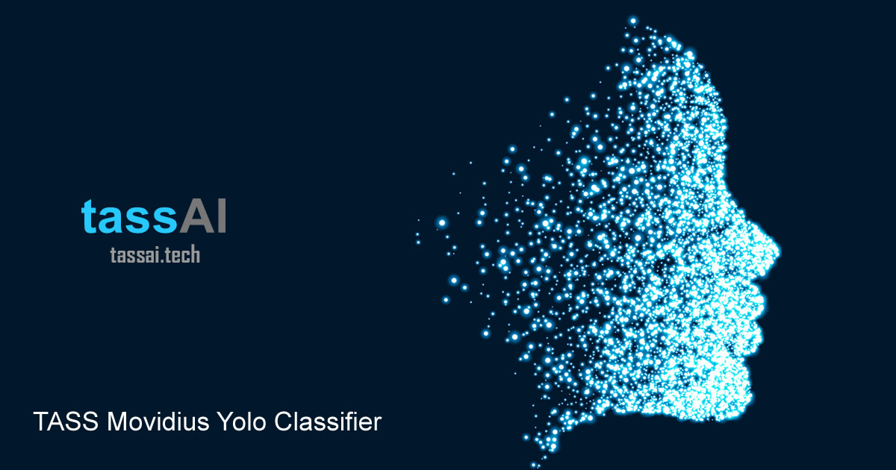

# TASS Movidius Classifiers

The **TASS Movidius Classifiers** are computer vision programs using a number of different models including **Inception V3**, **Yolo**, **dlib**, **OpenCV** and **Facenet**.

# TASS Movidius Facenet Classifier

The **TASS Movidius Facenet Classifier** uses Siamese Neural Networks and Triplet Loss to classify known and unknown faces. The project uses an UP2 the Intel Movidius and the [IoT JumpWay](https://iot.techbubbletechnologies.com "IoT JumpWay") for IoT connectivity.

The **TASS Movidius Yolo Classifier** uses a pretrained **Yolo model** and an **Intel® Movidius** to carry out object, both locally and on a live webcam stream. TASS Movidius uses the [IoT JumpWay](https://iot.techbubbletechnologies.com "IoT JumpWay") for IoT communication and publishes messages to the broker when an object is identified.