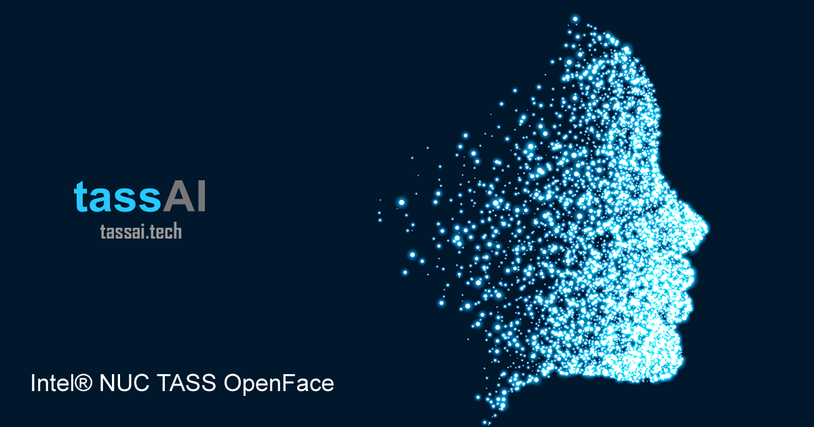

# IoT JumpWay Intel® NUC DE3815TYKE OpenFace TASS Computer Vision Example



## Introduction

Want to turn your Intel® NUC DE3815TYKE into an Artificially Intelligent, IoT Connected CCTV Hub? This tutorial is for you!.

[](https://devmesh.intel.com/projects/tass-network)

## What Will We Build?

The tutorial will use TechBubble Technologies IoT JumpWay Python MQTT Library for communication, an Intel® NUC DE3815TYKE 1 or more IP Cameras, an optional Realsense camera, and our own deep learning neural network based on the popular OpenFace facial recognition toolkit.

## Python Versions

- 2.7

## Software requirements

1. [TechBubble IoT JumpWay Python MQTT Client](https://github.com/TechBubbleTechnologies/IoT-JumpWay-Python-MQTT-Clients "TechBubble IoT JumpWay Python MQTT Client")
2. [OpenFace](https://github.com/cmusatyalab/openface "OpenFace")

## Hardware requirements

1. Intel® NUC DE3815TYKE (Should work with other versions of Intel® NUC).
2. 1 or more IP cameras.  (Tested with 1)
3. 1 x Realsense camera (OPTIONAL) (Tested with F200 & R200)

## Before You Begin

There are a few tutorials that you should follow before beginning, especially if it is the first time you have used the TechBubble IoT JumpWay Developer Program. If you do not already have one, you will require a TechBubble IoT JumpWay Developer Program developer account, and some basics to be set up before you can start creating your IoT devices. Visit the following [IoT JumpWay Developer Program Docs (5-10 minute read/setup)](https://github.com/TechBubbleTechnologies/IoT-JumpWay-Docs/ "IoT JumpWay Developer Program Docs (5-10 minute read/setup)") and check out the guides that take you through registration and setting up your Location Space, Zones, Devices and Applications (About 5 minutes read).

## Preparing Your Intel® NUC DE3815TYKE

If you do not already have Ubuntu Server 16.04 LTS installed on your Intel® NUC DE3815TYKE, follow the [Installing Ubuntu Server 16.04 LTS on Intel® NUC DE3815TYKE](https://github.com/TechBubbleTechnologies/IoT-JumpWay-Intel-Examples/blob/master/Intel-Nuc/DE3815TYKE/_DOCS/1-Installing-Ubuntu-Server.md "Installing Ubuntu Server 16.04 LTS on Intel® NUC DE3815TYKE") guide.

## Cloning The Repo

You will need to clone this repository to a location on your Intel® NUC DE3815TYKE. Navigate to the directory you would like to download it to and issue the following commands.

    $ git clone https://github.com/TechBubbleTechnologies/IoT-JumpWay-Intel-Examples.git

## Install Requirements

    $ cd IoT-JumpWay-Intel-Examples/Intel-Nuc/DE3815TYKE/Computer-Vision/Python/OpenFace
    $ sudo apt install python-pip
    $ pip install --upgrade pip
    $ sudo pip install -r requirements.txt

## Install Remaining Required Software

1. Follow the [Installing OpenFace on Intel® NUC DE3815TYKE](https://github.com/TechBubbleTechnologies/IoT-JumpWay-Intel-Examples/blob/master/Intel-Nuc/DE3815TYKE/_DOCS/2-Installing-OpenFace.md "Installing OpenFace on Intel® NUC DE3815TYKE") guide.

2. Follow the [Installing Librealsense & Pyrealsense on Intel® NUC DE3815TYKE](https://github.com/TechBubbleTechnologies/IoT-JumpWay-Intel-Examples/blob/master/Intel-Nuc/DE3815TYKE/_DOCS/3-Installing-Librealsense.md "Installing Librealsense & Pyrealsense on Intel® NUC DE3815TYKE") guide. (OPTIONAL BUT REQUIRED IF USING REALSENSE CAMERA)

## IoT JumpWay Device / Application Connection Credentials & Settings

- Follow the [TechBubble Technologies IoT JumpWay Developer Program (BETA) Location Application Doc](https://github.com/TechBubbleTechnologies/IoT-JumpWay-Docs/blob/master/5-Location-Applications.md "TechBubble Technologies IoT JumpWay Developer Program (BETA) Location Application Doc") to set up your IoT JumpWay Location Application.

- Setup an IoT JumpWay Location Device for each IP camera you will be connecting to, and / or your Realsense camera. For this example, we only require the device ID for each camera, we will not be using the MQTT details for each camera as the application is capable of sending data on behalf of any device in its location. Follow the [TechBubble Technologies IoT JumpWay Developer Program (BETA) Location Device Doc](https://github.com/TechBubbleTechnologies/IoT-JumpWay-Docs/blob/master/4-Location-Devices.md "TechBubble Technologies IoT JumpWay Developer Program (BETA) Location Device Doc") to set up your devices.


- Retrieve your connection credentials and update the config.json file with your new connection credentials and camera IDs, add a new entry to CameraList for each IP cam, and add your Realsense camera ID.

```
    "CameraList": [
        {
            "camID": Your Camera ID from the IoT JumpWay here,
            "camSensorID": Your Camera Sensor ID from the IoT JumpWay here,
            "camZone": Your Camera Zone ID from the IoT JumpWay here,
            "camURL": "URL to your IP camera here"
        }
    ],
    "RealsenseCam": {
        "localCamID": 0,
        "camID": Your Realsense Camera ID from the IoT JumpWay here,
        "camSensorID": Your Realsense Camera Sensor ID from the IoT JumpWay here,
        "camZone": Your Realsense Camera Zone ID from the IoT JumpWay here
    }
```

```
	"IoTJumpWayMQTTSettings": {
        "host": "https://iot.techbubbletechnologies.com",
        "port": "8883",
        "SystemLocation": Your Location ID from the IoT JumpWay here,
        "SystemApplicationID": Your Application ID from the IoT JumpWay here,
        "SystemApplicationName": "Your Application Name Here",
        "applicationUsername": "Your Application MQTT Username Here",
        "applicationPassword": "Your Application MQTT Password Here"
    }
```

## Preparing Training Data For Your Neural Network

To help solve the open set recognition issue (See KNOWN ISSUES below), we have provided 500 images from the [Labeled Faces in the Wild Dataset](http://vis-www.cs.umass.edu/lfw/ "Labeled Faces in the Wild Dataset"), this has been tested in small environments, but may not be an accurate solution in larger environments where there is more chance of someone resembling one of the unknown photos. All that remains for you to do is to collect your training data and add it to the training folder ready for training.

Create 1 or more folders in the training/1 directory, these folders will represent classes, and there should be 1 folder / class per person, name the folder using something that will allow you identify who the photos are of, the name of the folder / class will be used by the program to let you know who it has detected. You can use names, user IDs or anything you like for the folder / class names, but bear in mind privacy. We have successfully tested with 10 training images per class, but your application may need more or less than this.

## Training Your Neural Network

Now you have added your training data, you should train your neural network, navigate to the root of the project and execute the following command:

    $ python TassTrain.py

## Testing Your Neural Network

Before we go any further, we can now test your trained neural network. Add 1 or more images of each person / class you added to the training data into the testing directory, you should try with images that you did not use in the training data. Navigate to the root of the project and execute the following command:

    $ python TassTest.py

If the images you add to the testing directory are not classified correctly after running TassTest.py, you should re train with more examples.

## Using 1 Or More IP Cameras

Ensure you have set up your IP camera devices and added the settings correctly to your config.json as mentioned above, then navigate to the root of the project and execute the following command:

    $ python TassCore.py

The program will initiate and your live streams will be processed. First the program will detect if there is a face present in the frame, and then will send the frame through the neural network to detect if it is an intruder or a known person. For trouble shooting, see KNOWN ISSUES and TROUBLE SHOOTING below.

## Using A Realsense Camera

Ensure you have set up your Realsense camera device and adding the settings correctly to your config.json as mentioned above, then navigate to the root of the project and execute the following command:

    $ python TassRealsense.py

The program will initiate and your live stream will be processed. First the program will detect if there is a face present in the frame, and then will send the frame through the neural network to detect if it is an intruder or a known person. For trouble shooting, see KNOWN ISSUES and TROUBLE SHOOTING below.

## Seeing What Your Neural Network Sees

In the event that a face is detected, the frame will be saved in the frames folder, bounding boxes will be drawn around all faces that are detected and the frames will be placed into either detected or notdetected folders grouped by date. You can access these images by connecting to your NUC with SFTP and downloading them to your computer.

## Viewing Your Data

When the program detects a known user or intruder, it will send sensor and warning data for the device it was captured from to the [TechBubble IoT JumpWay](https://iot.techbubbletechnologies.com/ "TechBubble IoT JumpWay"). You will be able to access the data in the [TechBubble IoT JumpWay Developers Area](https://iot.techbubbletechnologies.com/developers/dashboard/ "TechBubble IoT JumpWay Developers Area"). Once you have logged into the Developers Area, visit the [TechBubble IoT JumpWay Location Devices Page](https://iot.techbubbletechnologies.com/developers/location-devices "Location Devices page"), find your device and then visit the Warnings & Sensor Data pages to view the data sent from the application.


## KNOWN ISSUES

1. The Open Set Recognition Issue: The Open Set Recognition Issue is where a neural network will identify someone that it has not been trained on, as someone that it has. In this version of TASS we have seemed to have solved this issue with the use of an unknown class consisting of 500 images of random people from the LFW dataset. In larger environments, this may not solve this issue, but in small environments such as a home or office it should.

2. Lighting: Lighting is unfortunately quite a large problem that we have not been able to solve as of yet. We find we have best results when there is bright light in front of the face.

## TROUBLE SHOOTING

1. If the program does not detect known faces, it is likely you need to add more training data to the classes, or play with the lighting.

## ACKNOWLEDGEMENTS

Parts of this project use code from the following projects:

- [OpenFace](https://github.com/cmusatyalab/openface "OpenFace")
- [Pyrealsense](https://github.com/toinsson/pyrealsense "Pyrealsense")

We would like to acknowledge and thank the creators of these projects.

## LICENSE

Copyright 2016, Adam Milton-Barker, TechBubble Technologies, All rights reserved.

Licensed under the Apache License, Version 2.0 (the "License"); you may not use this file except in compliance with the License. You may obtain a copy of the License at

http://www.apache.org/licenses/LICENSE-2

Unless required by applicable law or agreed to in writing, software distributed under the License is distributed on an "AS IS" BASIS, WITHOUT WARRANTIES OR CONDITIONS OF ANY KIND, either express or implied. See the License for the specific language governing permissions and limitations under the License.

## IoT JumpWay Intel® NUC DE3815TYKE Examples Bugs/Issues

Please feel free to create issues for bugs and general issues you come across whilst using the Intel® NUC DE3815TYKE Docs. You may also use the issues area to ask for general help whilst using the IoT JumpWay Intel® Examples in your IoT projects.

## IoT JumpWay Intel® NUC DE3815TYKE Examples Contributors

- [Adam Milton-Barker, TechBubble Technologies Founder](https://github.com/AdamMiltonBarker "Adam Milton-Barker, TechBubble Technologies Founder")

