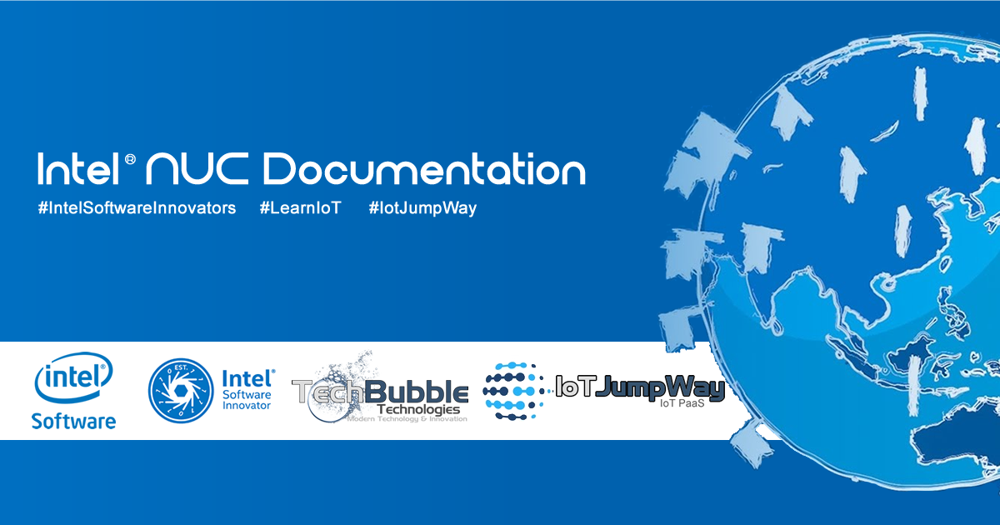

# Installing OpenFace on Intel® NUC DE3815TYKE

## Introduction

The following information will help you install OpenFace on the Intel® Nuc DE3815TYKE.

## OpenFace Prerequisites

1. sudo apt install git

2. git clone https://github.com/cmusatyalab/openface.git  --recursive

## Install OpenCV 2.4.11

1. sudo apt-get install build-essential

2. sudo apt-get install cmake git libgtk2.0-dev pkg-config libavcodec-dev libavformat-dev libswscale-dev

3. sudo apt-get install python-dev python-numpy libtbb2 libtbb-dev libjpeg-dev libpng-dev libtiff-dev libjasper-dev libdc1394-22-dev

4. wget https://github.com/Itseez/opencv/archive/2.4.11.zip

5. sudo apt install unzip

6. unzip 2.4.11.zip

7. cd ~/opencv-2.4.11 && mkdir release && cd release

8. cmake -D CMAKE_BUILD_TYPE=RELEASE -D CMAKE_INSTALL_PREFIX=/usr/local ..

9. make

10. sudo make install

## Install DLib

1. sudo apt-get install libopenblas-dev liblapack-dev

2. sudo apt-get install libboost-all-dev

3. mkdir -p ~/src && cd ~/src

4. wget https://github.com/davisking/dlib/releases/download/v18.16/dlib-18.16.tar.bz2

5. tar xf dlib-18.16.tar.bz2

6. cd dlib-18.16/python_examples

7. mkdir build && cd build

8. cmake ../../tools/python

9. cmake --build . --config Release

10. sudo cp dlib.so /usr/local/lib/python2.7/dist-packages

## Install Torch

1. git clone https://github.com/torch/distro.git ~/torch --recursive

2. cd ~/torch; bash install-deps;

3. ./install.sh

4. source ~/.bashrc

5. for NAME in dpnn nn optim optnet csvigo cutorch cunn fblualib torchx tds; do luarocks install $NAME; done

## OpenFace Installation

1. cd ~/openface

2. sudo python2 setup.py install

## IoT JumpWay Intel® NUC DE3815TYKE Bugs/Issues

Please feel free to create issues for bugs and general issues you come across whilst using the IoT JumpWay Intel® Examples. You may also use the issues area to ask for general help whilst using the IoT JumpWay Intel® Examples in your IoT projects.

## IoT JumpWay Intel® NUC DE3815TYKE Examples Document Contributors

- [Adam Milton-Barker, TechBubble Technologies Founder](https://github.com/AdamMiltonBarker "Adam Milton-Barker, TechBubble Technologies Founder")

