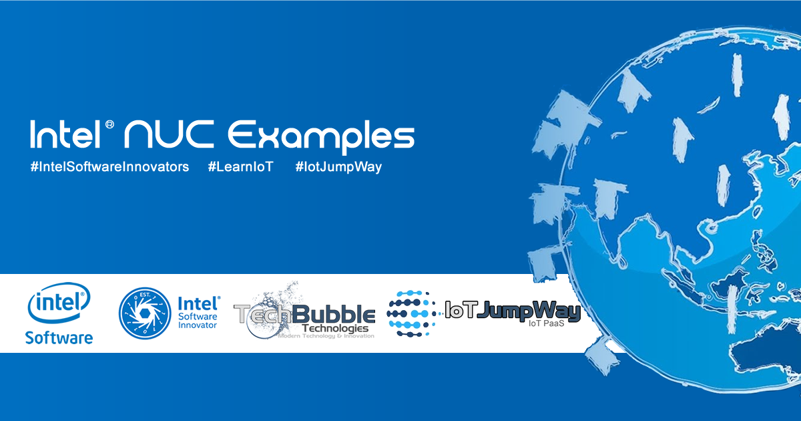

# IoT JumpWay Intel® NUC Examples

## Introduction

TechBubble Technologies Internet of Things (IoT) JumpWay is an IoT PaaS that allows anyone to connect IoT devices such as Raspberry Pi, Intel® Edison, Arduino, ESP8266 and even phones,PCs, Macs and laptops to the Internet of Things. The various IoT JumpWay libraries and samples allow you to connect devices and sensors to the IoT JumpWay and control/monitor sensors/actuators and data to and from the devices.

The Intel® NUC examples provide example projects that you can use to get started with using the IoT JumpWay for your Intel® NUC projects.

## IoT JumpWay Intel® NUC DE3815TYKE Examples

- [IoT JumpWay Intel® NUC DE3815TYKE OpenFace TASS Computer Vision Example](https://github.com/iotJumpway/IoT-JumpWay-Intel-Examples/tree/master/Intel-Nuc/DE3815TYKE/Computer-Vision/Python/OpenFace "IoT JumpWay Intel® NUC DE3815TYKE OpenFace TASS Computer Vision Example")

## IoT JumpWay Intel® NUC DE3815TYKE Tutorials

- [Installing Ubuntu Server 16.04 LTS on Intel® NUC DE3815TYKE](https://github.com/iotJumpway/IoT-JumpWay-Intel-Examples/blob/master/Intel-Nuc/DE3815TYKE/_DOCS/1-Installing-Ubuntu-Server.md "Installing Ubuntu Server 16.04 LTS on Intel® NUC DE3815TYKE")

- [Installing OpenFace on Intel® NUC DE3815TYKE](https://github.com/iotJumpway/IoT-JumpWay-Intel-Examples/blob/master/Intel-Nuc/DE3815TYKE/_DOCS/2-Installing-OpenFace.md "Installing OpenFace on Intel® NUC DE3815TYKE")

- [Installing Librealsense & Pyrealsense on Intel® NUC DE3815TYKE](https://github.com/iotJumpway/IoT-JumpWay-Intel-Examples/blob/master/Intel-Nuc/DE3815TYKE/_DOCS/3-Installing-Librealsense.md "Installing Librealsense & Pyrealsense on Intel® NUC DE3815TYKE")

## IoT JumpWay Intel® NUC Bugs/Issues

Please feel free to create issues for bugs and general issues you come across whilst using the IoT JumpWay Intel® NUC Examples. You may also use the issues area to ask for general help whilst using the IoT JumpWay Intel® Examples in your IoT projects.

## IoT JumpWay Intel® NUC Examples Contributors

- [Adam Milton-Barker, TechBubble Technologies Founder](https://github.com/iotJumpway "Adam Milton-Barker, TechBubble Technologies Founder")

