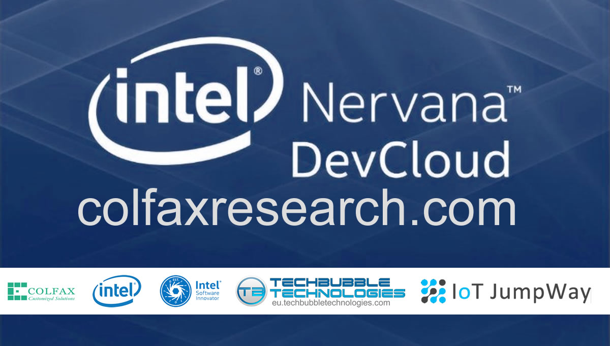

# IoT JumpWay Intel® Examples

## Introduction

The IoT JumpWay is an IoT platform that provides a high performance, scalable and efficient solution for IoT developers and Makers. The platform provides the fundamental services that allow you to securely distribute data from IoT devices and manage and control them securely via applications.

The platform provides an IoT PaaS for IoT communication, tutorials and examples. Connect IoT devices such as Raspberry Pi, Intel® NUC, Intel® Edison, Intel® Galileo, Arduino, ESP8266 and even phones,PCs, Macs and laptops to the Internet of Things. 

The various IoT JumpWay libraries and samples allow you to connect devices and sensors to the IoT JumpWay and control/monitor sensors/actuators and data to and from the devices.

The Intel® examples provide example projects that you can use to get started with using the TechBubble IoT JumpWay for your Intel® IoT Developer Kit, Intel® Edison board, Intel® Galileo, Intel® Joule and Intel® IoT Gateway (Nuc) projects.

# Intel® Nervana AI / Colfax Examples

## Intel® Computer Vision SDK Windows Examples

- [IoT JumpWay Intel® Computer Vision SDK Windows Console TASS PVL Webcam Security System](https://github.com/TechBubbleTechnologies/IoT-JumpWay-Intel-Examples/tree/master/Intel-Computer-Vision-SDK/TASS-PVL/Windows/Webcam/ConsoleApp "IoT JumpWay Intel® Computer Vision SDK Windows Console TASS PVL Webcam Security System")

- [IoT JumpWay Intel® Computer Vision SDK Windows Console TASS PVL RealSense Security System](https://github.com/TechBubbleTechnologies/IoT-JumpWay-Intel-Examples/tree/master/Intel-Computer-Vision-SDK/TASS-PVL/Windows/Realsense/ConsoleApp "IoT JumpWay Intel® Computer Vision SDK Windows TASS PVL RealSense Security System")

## IoT JumpWay Intel® Arduino 101 Examples

- [Intel® Arduino 101 Basic LED Example](https://github.com/TechBubbleTechnologies/IoT-JumpWay-Intel-Examples/tree/master/Intel-Arduino-101/Basic-LED "Intel® Arduino 101 Basic LED Example")

- [Intel® Arduino 101 Dev Kit LED Example](https://github.com/TechBubbleTechnologies/IoT-JumpWay-Intel-Examples/tree/master/Intel-Arduino-101/Basic-LED "Intel® Arduino 101 Dev Kit LED Example")

## IoT JumpWay Intel® DFRobot Examples

- [Intel® Arduino 101 DF Robot LCD Control Example](https://github.com/TechBubbleTechnologies/IoT-JumpWay-Intel-Examples/tree/master/Intel-Arduino-101/3RD-PARTY-DFRobot/LCD-Control "Intel® Arduino 101 DF Robot LCD Control Example")

- [Intel® Arduino 101 DF Robot LCD Intruder System Example](https://github.com/TechBubbleTechnologies/IoT-JumpWay-Intel-Examples/tree/master/Intel-Arduino-101/3RD-PARTY-DFRobot/LCD-Intruder-System "Intel® Arduino 101 DF Robot LCD Intruder System Example")

## IoT JumpWay Intel® Edison Examples

- [Intel® Edison Basic LED Python Example](https://github.com/TechBubbleTechnologies/IoT-JumpWay-Intel-Examples/tree/master/Intel-Edison/Basic-LED/Python "Intel® Edison Basic LED Python Example")

- [Intel® Edison Dev Kit LED Python Example](https://github.com/TechBubbleTechnologies/IoT-JumpWay-Intel-Examples/tree/master/Intel-Edison/Dev-Kit-LED/Python "Intel® Edison Dev Kit LED Python Example")

- [Intel® Edison Dev Kit IoT Alarm](https://github.com/TechBubbleTechnologies/IoT-JumpWay-Intel-Examples/tree/master/Intel-Edison/Dev-Kit-IoT-Alarm/NodeJS "IoT JumpWay Intel® Edison Dev Kit IoT Alarm")

## IoT JumpWay Intel® Galileo Examples

- [Intel® Galileo Basic LED Python Example](https://github.com/TechBubbleTechnologies/IoT-JumpWay-Intel-Examples/tree/master/Intel-Galileo/Basic-LED/Python "Intel® Galileo Basic LED Python Example")

- [Intel® Galileo Dev Kit LED Python Example](https://github.com/TechBubbleTechnologies/IoT-JumpWay-Intel-Examples/tree/master/Intel-Galileo/Dev-Kit-LED/Python "Intel® Galileo Dev Kit LED Python Example")

## IoT JumpWay Intel® Bugs/Issues

Please feel free to create issues for bugs and general issues you come accross whilst using the IoT JumpWay Intel Examples. You may also use the issues area to ask for general help whilst using the IoT JumpWay Intel Examples in your IoT projects.

## IoT JumpWay Intel® Contributors

[Adam Milton-Barker, TechBubble Technologies Founder](https://github.com/AdamMiltonBarker "Adam Milton-Barker, TechBubble Technologies Founder")

