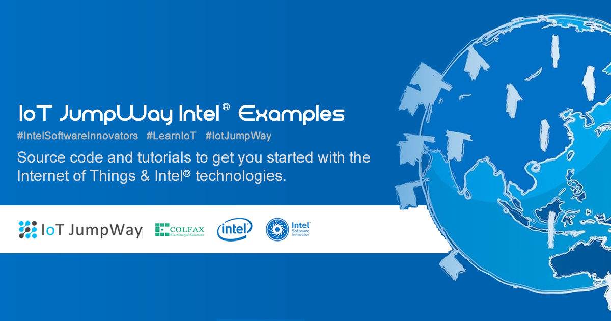
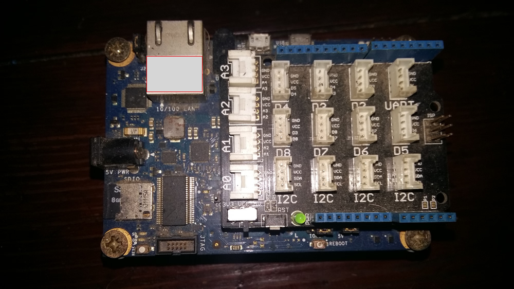
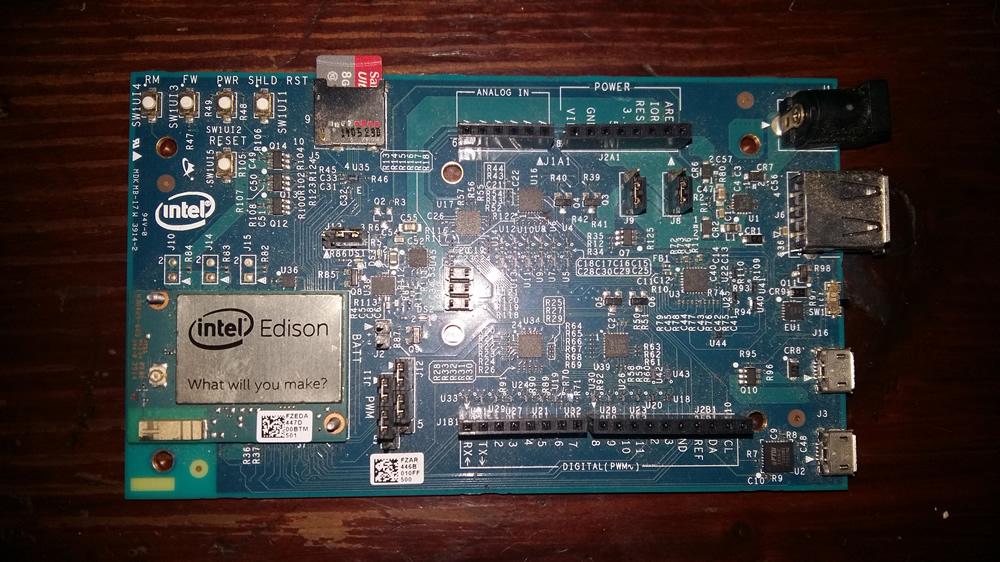
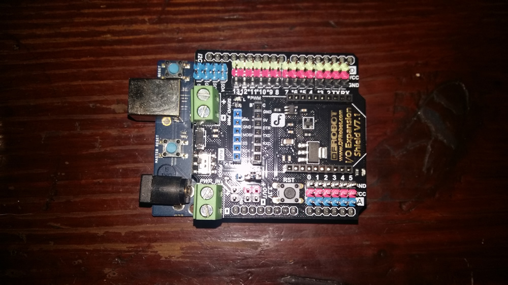

# IoT JumpWay Intel® Examples

  

## Introduction

TechBubble Technologies Internet of Things (IoT) JumpWay is an IoT PaaS that allows anyone to connect IoT devices such as Raspberry Pi, Intel® Galileo, Arduino, ESP8266 and even phones,PCs, Macs and laptops to the Internet of Things. The various IoT JumpWay libraries and samples allow you to connect devices and sensors to the IoT JumpWay and control/monitor sensors/actuators and data to and from the devices.

The Intel® examples provide example projects that you can use to get started with using the TechBubble IoT JumpWay for your Intel® IoT Developer Kit, Intel® Edison board, Intel® Galileo, Intel® Joule and Intel® IoT Gateway (Nuc) projects.

## IoT JumpWay Intel® Galileo Examples

- [Intel® Galileo Basic LED Python Example](https://github.com/TechBubbleTechnologies/IoT-JumpWay-Intel-Examples/tree/master/Intel-Galileo/Basic-LED/Python "Intel® Galileo Basic LED Python Example")

- [Intel® Galileo Dev Kit LED Python Example](https://github.com/TechBubbleTechnologies/IoT-JumpWay-Intel-Examples/tree/master/Intel-Galileo/Dev-Kit-LED/Python "Intel® Galileo Dev Kit LED Python Example")

## IoT JumpWay Intel® Edison Examples

- [Intel® Edison Basic LED Python Example](https://github.com/TechBubbleTechnologies/IoT-JumpWay-Intel-Examples/tree/master/Intel-Edison/Basic-LED/Python "Intel® Edison Basic LED Python Example")

- [Intel® Edison Dev Kit LED Python Example](https://github.com/TechBubbleTechnologies/IoT-JumpWay-Intel-Examples/tree/master/Intel-Edison/Dev-Kit-LED/Python "Intel® Edison Dev Kit LED Python Example")

## IoT JumpWay Intel® Arduino 101 Examples

- [Intel® Arduino 101 Basic LED Example](https://github.com/TechBubbleTechnologies/IoT-JumpWay-Intel-Examples/tree/master/Intel-Arduino-101/Basic-LED "Intel® Arduino 101 Basic LED Example")

- [Intel® Arduino 101 Dev Kit LED Example](https://github.com/TechBubbleTechnologies/IoT-JumpWay-Intel-Examples/tree/master/Intel-Arduino-101/Basic-LED "Intel® Arduino 101 Dev Kit LED Example")

## IoT JumpWay Intel® Arduino 101 DFRobot Examples

- [Intel® Arduino 101 DF Robot LCD Control Example](https://github.com/TechBubbleTechnologies/IoT-JumpWay-Intel-Examples/tree/master/Intel-Arduino-101/3RD-PARTY-DFRobot/LCD-Control "Intel® Arduino 101 DF Robot LCD Control Example")

- [Intel® Arduino 101 DF Robot LCD Intruder System Example](https://github.com/TechBubbleTechnologies/IoT-JumpWay-Intel-Examples/tree/master/Intel-Arduino-101/3RD-PARTY-DFRobot/LCD-Intruder-System "Intel® Arduino 101 DF Robot LCD Intruder System Example")

## IoT JumpWay Intel® Examples Docs

- [Intel® Galileo Docs](https://github.com/TechBubbleTechnologies/IoT-JumpWay-Intel-Examples/tree/master/Intel-Galileo/_DOCS "Intel® Galileo Docs")
- [Intel® Edison Docs](https://github.com/TechBubbleTechnologies/IoT-JumpWay-Intel-Examples/tree/master/Intel-Edison/_DOCS "Intel® Edison Docs")

## IoT JumpWay Intel® Bugs/Issues

Please feel free to create issues for bugs and general issues you come accross whilst using the IoT JumpWay Intel Examples. You may also use the issues area to ask for general help whilst using the IoT JumpWay Intel Examples in your IoT projects.

## IoT JumpWay Intel® Contributors

- [Adam Milton-Barker, TechBubble Technologies Founder](https://github.com/AdamMiltonBarker "Adam Milton-Barker, TechBubble Technologies Founder")

  