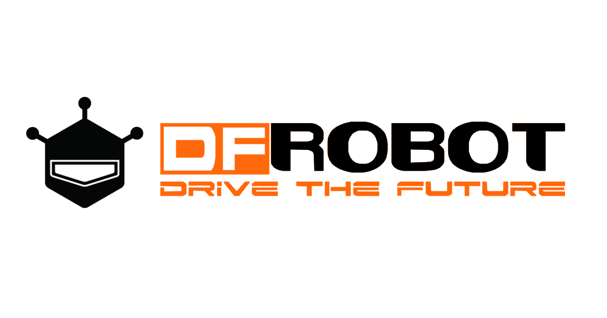
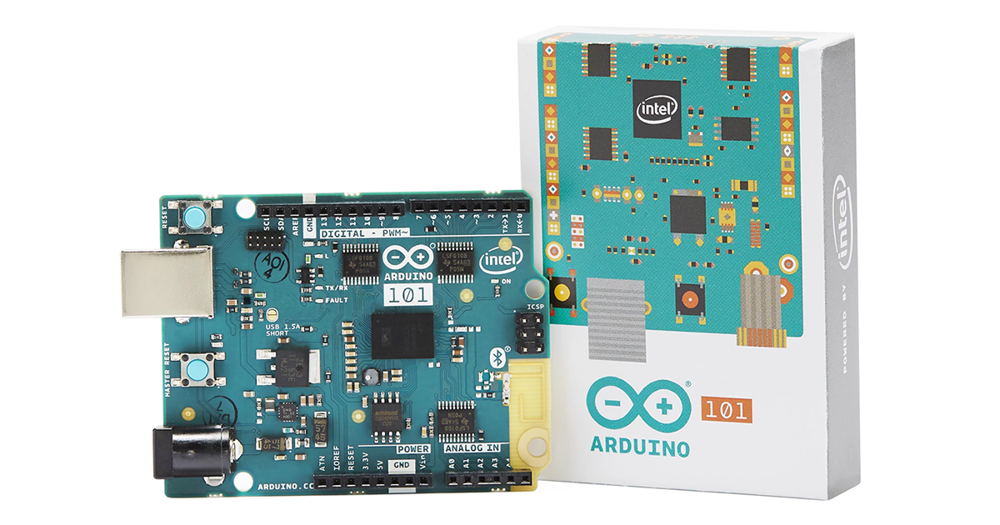
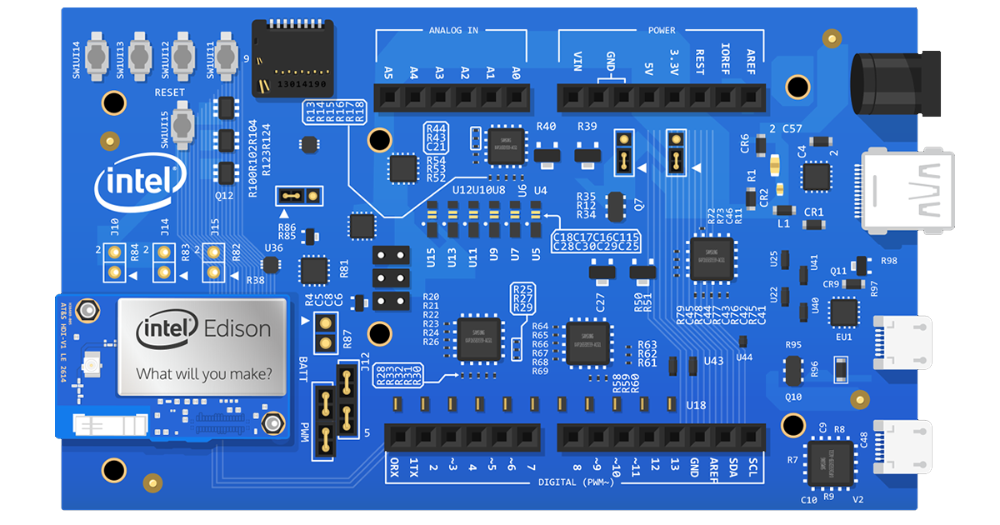
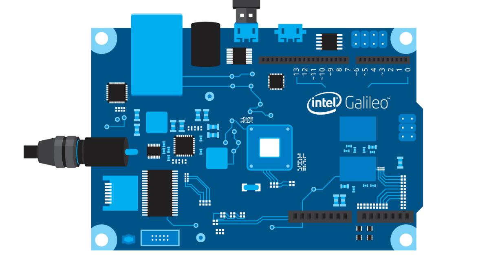

# IoT JumpWay Intel® Examples

## Introduction

The **IoT JumpWay** is an IoT platform that provides a high performance, scalable and efficient solution for IoT developers and Makers. The platform provides the fundamental services that allow you to securely distribute data from IoT devices and manage and control them securely via applications.

The platform provides an **IoT PaaS** for **IoT communication**, **tutorials** and **examples**. The **IoT JumpWay Intel® examples** provide example projects that you can use to get started using the **IoT JumpWay** for your **Intel®** IoT projects. Connect **Intel®** devices and sensors to the IoT JumpWay and control/monitor sensors/actuators and data to and from the devices.

## Intel® Movidius Examples

"Intel® Movidius™ VPUs drive the demanding workloads of modern computer vision and AI applications at ultra-low power. By coupling highly parallel programmable compute with workload-specific hardware acceleration, and co-locating these components on a common intelligent memory fabric, Movidius achieves a unique balance of power efficiency and high performance. Movidius technology allows device makers to deploy deep neural network and computer vision applications in categories such as smartphones, drones, intelligent cameras and augmented reality devices."

- [Python: TASS Movidius Example](https://github.com/iotJumpway/IoT-JumpWay-Intel-Examples/tree/master/Intel-Movidius/TASS "Python: TASS Movidius Example"). Uses pretrained Inception V3 & Yolo models with an Intel® Movidius to carry out object and facial classification, both locally and on a live webcam stream.

## Intel® AI DevCloud Examples

"The Intel® AI DevCloud is a cluster of Intel® Xeon® Scalable Processors that will assist you with your machine learning and deep learning training and inference compute needs. It provides access to precompiled software optimized for Intel® architecture on Intel® Xeon® Scalable Processors."

- [Python: Intel® AI DevCloud TASS Trainer](https://github.com/iotJumpway/IoT-JumpWay-Intel-Examples/tree/master/Intel-Colfax/Tass-Trainer "Python: Intel® AI DevCloud TASS Trainer"). Train TASS on the Intel® AI DevCloud platform.

## Intel® Computer Vision SDK Examples

"The Intel® Computer Vision SDK is a comprehensive toolkit that can be used for developing and deploying computer vision solutions on Intel® platforms, including autonomous vehicles, digital surveillance cameras, robotics, and mixed-reality headsets."

- [Windows Console: TASS PVL Webcam](https://github.com/iotJumpway/IoT-JumpWay-Intel-Examples/tree/master/Intel-Computer-Vision-SDK/TASS-PVL/Windows/Webcam/ConsoleApp "Windows Console: TASS PVL Webcam"). A Computer Vision security system using the Intel® CV SDK & webcam.

- [Windows Console: TASS PVL RealSense](https://github.com/iotJumpway/IoT-JumpWay-Intel-Examples/tree/master/Intel-Computer-Vision-SDK/TASS-PVL/Windows/Realsense/ConsoleApp "Windows Console: TASS PVL RealSense"). A Computer Vision security system using the Intel® CV SDK & RealSense.

## Intel® Arduino 101 DFRobot Examples

- [Arduino: LCD Control Example](https://github.com/iotJumpway/IoT-JumpWay-Intel-Examples/tree/master/Intel-Arduino-101/3RD-PARTY-DFRobot/LCD-Control "Arduino: LCD Control Example"). Set up an Arduino 101 IoT device that can control other IoT devices on the same network using the LCD Keypad Shield and communication via the IoT JumpWay.

- [Arduino: LCD Intruder System Example](https://github.com/iotJumpway/IoT-JumpWay-Intel-Examples/tree/master/Intel-Arduino-101/3RD-PARTY-DFRobot/LCD-Intruder-System "Arduino: LCD Intruder System Example"). Set up an Arduino 101 intruder alarm system that is controlled by the DFRobot LCD Keypad Shield and communication via the IoT JumpWay.

## Intel® Arduino 101 Examples

- [Arduino: Basic LED Example](https://github.com/iotJumpway/IoT-JumpWay-Intel-Examples/tree/master/Intel-Arduino-101/Basic-LED "Arduino: Basic LED Example"). Set up an Arduino/Genuino 101 that allows control of an LED, and also an application that can control the LED via the IoT JumpWay.

## Intel® Edison Examples

- [Python: Basic LED Example](https://github.com/iotJumpway/IoT-JumpWay-Intel-Examples/tree/master/Intel-Edison/Basic-LED/Python "Python: Basic LED Example"). Set up an Intel® Edison that allows control of an LED, and also an application that can control the LED via the IoT JumpWay.

- [Python: Dev Kit LED Example](https://github.com/iotJumpway/IoT-JumpWay-Intel-Examples/tree/master/Intel-Edison/Dev-Kit-LED/Python "Python: Dev Kit LED Example"). Set up an Intel® Edison that allows control of an LED on an IoT Dev Kit and an application that can control the LED via the IoT JumpWay.

- [Python: Dev Kit IoT Alarm](https://github.com/iotJumpway/IoT-JumpWay-Intel-Examples/tree/master/Intel-Edison/Dev-Kit-IoT-Alarm/NodeJS "Python: Dev Kit IoT Alarm"), Set up an Intel® Edison IoT alarm system that is controlled by the IoT JumpWay.

## Intel® Galileo Examples

- [Python: Basic LED Example](https://github.com/iotJumpway/IoT-JumpWay-Intel-Examples/tree/master/Intel-Galileo/Basic-LED/Python "Python: Basic LED Example"). Set up an Intel® Galileo that allows control of an LED, and also an application that can control the LED via the IoT JumpWay.

- [Python: Dev Kit LED Example](https://github.com/iotJumpway/IoT-JumpWay-Intel-Examples/tree/master/Intel-Galileo/Dev-Kit-LED/Python "Python: Dev Kit LED Example"). Set up an Intel® Galileo that allows control of an LED on an IoT Dev Kit and an application that can control the LED via the IoT JumpWay.

## Bugs/Issues

Please feel free to create issues for bugs and general issues you come across whilst using this or any other Intel® related IoT JumpWay issues. You may also use the issues area to ask for general help whilst using the IoT JumpWay in your IoT projects.

## Contributors

