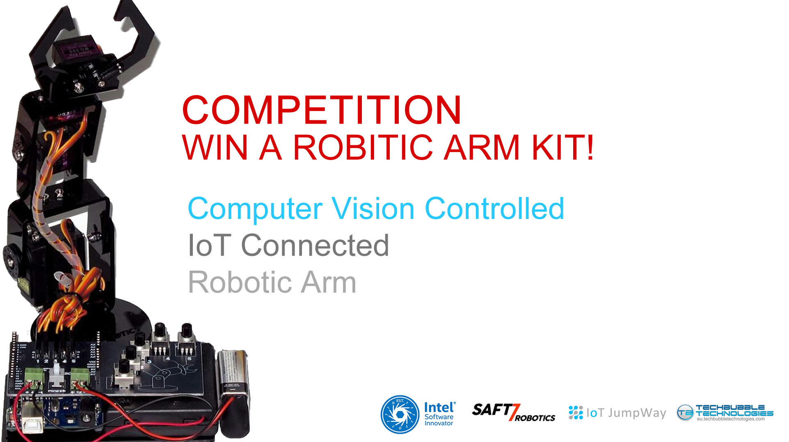

# Robotic Arm ESP8266 Communication Program



## Introduction

Here you will find the ESP8266 Communication Program that allows the robotic arm to talk to the IoT JumpWay. The codes allow you to set up a device that can connect to the Internet of Things and waits for commands sent to the arm, forwarding them to the arm via serial.

## Hardware Requirements

1. ESP8266

## Software requirements

1. ESP8266WiFi
2. PubSubClient MQTT  
3. ArduinoJson
4. WiFiClientSecure

## Cloning The Repo

You will need to clone this repository to a location on your development terminal. Navigate to the directory you would like to download it to and issue the following commands.

    $ git clone https://github.com/TechBubbleTechnologies/IoT-JumpWay-Intel-Examples.git
	
Once you have the repo, you will need to find the files in this folder located in [this location](https://github.com/TechBubbleTechnologies/IoT-JumpWay-Intel-Examples/tree/master/Robotic-Arm/ESP8266 "this location")

## Before You Begin

There are a few tutorials that you should follow before beginning, especially if it is the first time you have used the TechBubble IoT JumpWay Developer Program. If you do not already have one, you will require a TechBubble IoT JumpWay Developer Program developer account, and some basics to be set up before you can start creating your IoT devices. Visit the following [IoT JumpWay Developer Program Docs (5-10 minute read/setup)](https://github.com/TechBubbleTechnologies/IoT-JumpWay-Docs/ "IoT JumpWay Developer Program Docs (5-10 minute read/setup)") and check out the guides that take you through registration and setting up your Location Space, Zones, Devices and Applications (About 5 minutes read).

## Connection Credentials

- Follow the [TechBubble Technologies IoT JumpWay Developer Program (BETA) Location Device Doc-](https://github.com/TechBubbleTechnologies/IoT-JumpWay-Docs/blob/master/4-Location-Devices.md "TechBubble Technologies IoT JumpWay Developer Program (BETA) Location Device Doc") to set up your device. 

- Add your WiFi credentials to the following code which will allow your ESP8266 to connect to the internet.

```
	const char* ssid = "YourSSID";
    const char* password = "YourWiFiPassword";
```

- Retrieve your connection credentials and update the config.json file with your new connection  credentials and sensor setting.

```
    String locationID = "YourLocationID";
    String zoneID = "YourZoneID";
    String deviceID = "YourDeviceID";
    char deviceName[] = "YourDeviceName"; 
    char mqttUsername[]   = "YourDeviceMQTTUsername"; 
    char mqttPassword[]  = "YourDeviceMQTTPassword";